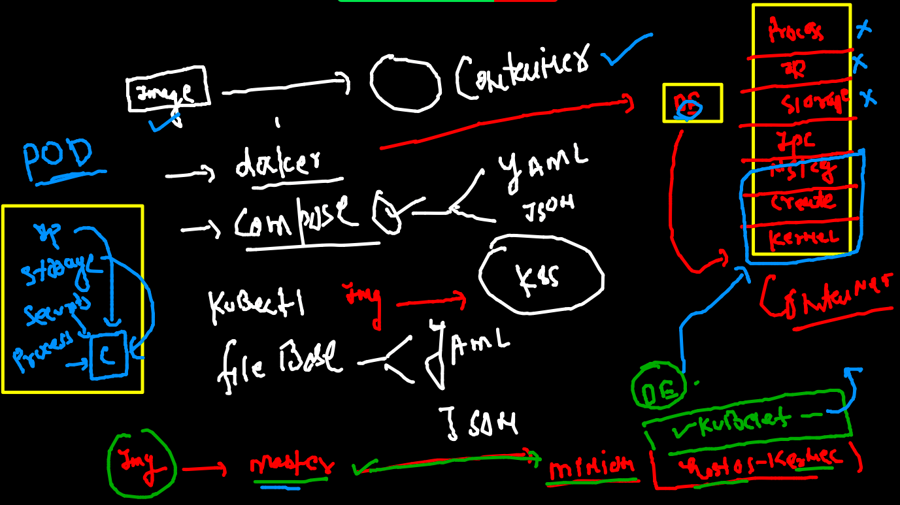
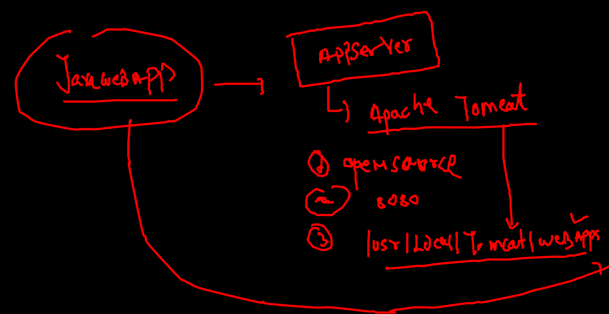

# Plan of training 


## Revision 


## K8s env setup options 


## Minikube 


### Installing Minikube On Mac 

[Install]('https://minikube.sigs.k8s.io/docs/start/')

```
curl -LO https://storage.googleapis.com/minikube/releases/latest/minikube-darwin-amd64
 sudo install minikube-darwin-amd64 /usr/local/bin/minikube
```


### checking installation 

```
minikube version 
minikube version: v1.23.2
commit: 0a0ad764652082477c00d51d2475284b5d39ceed
```

### MInikube to create Kubernetes ENV of single Node 

```
 fire@ashutoshhs-MacBook-Air  ~  minikube start 
😄  minikube v1.23.2 on Darwin 11.6
✨  Using the docker driver based on existing profile
👍  Starting control plane node minikube in cluster minikube
🚜  Pulling base image ...
🏃  Updating the running docker "minikube" container ...
🐳  Preparing Kubernetes v1.22.2 on Docker 20.10.8 ...
🔎  Verifying Kubernetes components...
    ▪ Using image gcr.io/k8s-minikube/storage-provisioner:v5
🌟  Enabled addons: storage-provisioner, default-storageclass
🏄  Done! kubectl is now configured to use "minikube" cluster and "default" namespace by default

```

### Status is running 

```
minikube  status
minikube
type: Control Plane
host: Running
kubelet: Running
apiserver: Running
kubeconfig: Configured


```

### checking k8s client software 

```
kubectl  version  --client 
Client Version: version.Info{Major:"1", Minor:"21", GitVersion:"v1.21.1", GitCommit:"5e58841cce77d4bc13713ad2b91fa0d961e69192", GitTreeState:"clean", BuildDate:"2021-05-12T14:18:45Z", GoVersion:"go1.16.4", Compiler:"gc", Platform:"darwin/amd64"}

```

### kubectl the client of kubernetes 

```
kubectl  version           
Client Version: version.Info{Major:"1", Minor:"21", GitVersion:"v1.21.1", GitCommit:"5e58841cce77d4bc13713ad2b91fa0d961e69192", GitTreeState:"clean", BuildDate:"2021-05-12T14:18:45Z", GoVersion:"go1.16.4", Compiler:"gc", Platform:"darwin/amd64"}
Server Version: version.Info{Major:"1", Minor:"22", GitVersion:"v1.22.2", GitCommit:"8b5a19147530eaac9476b0ab82980b4088bbc1b2", GitTreeState:"clean", BuildDate:"2021-09-15T21:32:41Z", GoVersion:"go1.16.8", Compiler:"gc", Platform:"linux/amd64"}
 fire@ashutoshhs-MacBook-Air  ~  
                                                                                                        
 fire@ashutoshhs-MacBook-Air  ~  
 fire@ashutoshhs-MacBook-Air  ~  kubectl  get   nodes
NAME       STATUS   ROLES                  AGE   VERSION
minikube   Ready    control-plane,master   14m   v1.22.2

```

### Any k8s cluster / master node you can connecting using token / certificates 

### On master node (cluster side) location of token file

```
 cd  /etc/kubernetes/
[root@masternode kubernetes]# ls
admin.conf  c

```

### connecting to k8s remote 

```
kubectl  get  nodes  --kubeconfig  admin.conf 
NAME         STATUS   ROLES                  AGE    VERSION
masternode   Ready    control-plane,master   128m   v1.22.2
node1        Ready    <none>                 127m   v1.22.2
node2        Ready    <none>                 127m   v1.22.2

```

### setting up admin.conf as default 

```
 cp -v  ~/Desktop/admin.conf  config 
/Users/fire/Desktop/admin.conf -> config
 fire@ashutoshhs-MacBook-Air  ~/.kube  ls
cache                  config.backup          kubectl_autocompletion
config                 http-cache             storage
 fire@ashutoshhs-MacBook-Air  ~/.kube  cd
                                                                                                             
 fire@ashutoshhs-MacBook-Air  ~  
 fire@ashutoshhs-MacBook-Air  ~  kubectl  get  nodes
NAME         STATUS   ROLES                  AGE    VERSION
masternode   Ready    control-plane,master   139m   v1.22.2
node1        Ready    <none>                 138m   v1.22.2
node2        Ready    <none>                 138m   v1.22.2

```

### Intro to POD 



### java webapp image building with Tomcat application 



###  Building docker image from github 

```
docker  build  -t  dockerashu/javawebapp:v1  https://github.com/redashu/javawebapp.git 
Sending build context to Docker daemon  154.6kB
Step 1/6 : FROM tomcat
latest: Pulling from library/tomcat
bb7d5a84853b: Pull complete 
f02b617c6a8c: Pull complete 
d32e17419b7e: Pull complete 
c9d2d81226a4: Pull complete 
fab4960f9cd2: Pull complete 
da1c1e7baf6d: Pull complete 
79b231561270: Pull complete 
7d337880d8b4: Pull complete 
2df65a31be06: Pull complete 
10cbf519de23: Pull complete 
Digest: sha256:7c30d3c92b191ec2b84f64be99326f9c83a4a4e079c899ee4d0a9a41abca8406
Status: Downloaded newer image for tomcat:latest
 ---> 4ce9babdd885
Step 2/6 : WORKDIR /usr/local/tomcat/webapps
 ---> Running in 1740c1a68d9b
Removing intermediate container 1740c1a68d9b

```

### testing container app 

```
 docker  run -itd --name ashujc1  -p 1166:8080  dockerashu/javawebapp:v1 
 
```

### push to dockerhub 

```
docker  login  
Login with your Docker ID to push and pull images from Docker Hub. If you don't have a Docker ID, head over to https://hub.docker.com to create one.
Username: dockerashu
Password: 
WARNING! Your password will be stored unencrypted in /home/ashu/.docker/config.json.
Configure a credential helper to remove this warning. See
https://docs.docker.com/engine/reference/commandline/login/#credentials-store

Login Succeeded
[ashu@ip-172-31-19-234 ashuimages]$ docker  push  dockerashu/javawebapp:v1
The push refers to repository [docker.io/dockerashu/javawebapp]
7b673bd563c8: Mounted from vidhijain27/javawebapp 
2d7b521c4bf7: Mounted from vidhijain27/javawebapp 
c27bab1cef5b: Mounted from vidhijain27/javawebapp 
7cee8d773191: Mounted from vidhijain27/javawebapp 
ecf2a68d58aa: Mounted from vidhijain27/javawebapp 
211736d7fc9d: Mounted from vidhijain27/javawebapp 
62a5b8741e83: Mounted from vidhijain27/javawebapp 
36e0782f1159: Mounted from vidhijain27/javawebapp 
ba6e5ff31f23: Mounted from vidhijain27/javawebapp 
9f9f651e9303: Mounted from vidhijain27/javawebapp 
0b3c02b5d746: Mounted from vidhijain27/javawebapp 
62a747bf1719: Mounted from vidhijain27/javawebapp 
v1: digest: sha256:06c4d0c690190703ab2d070c4b587ce0cfed9db58b2cfc3079fe9bd9f8f26805 size: 2838
[ashu@ip-172-31-19-234 ashuimages]$ docker logout 
Removing login credentials for https://index.docker.io/v1/

```


