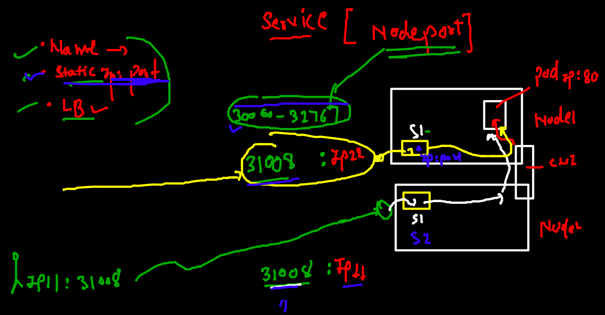
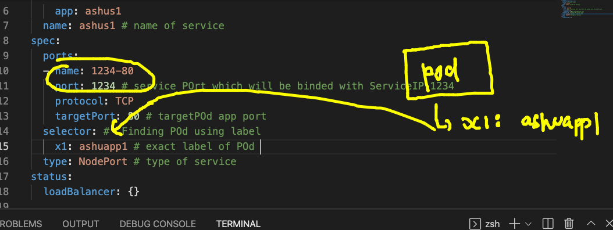
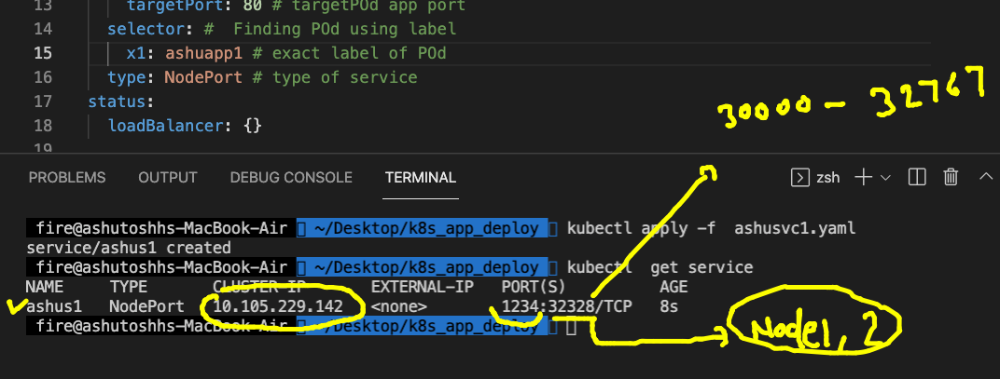
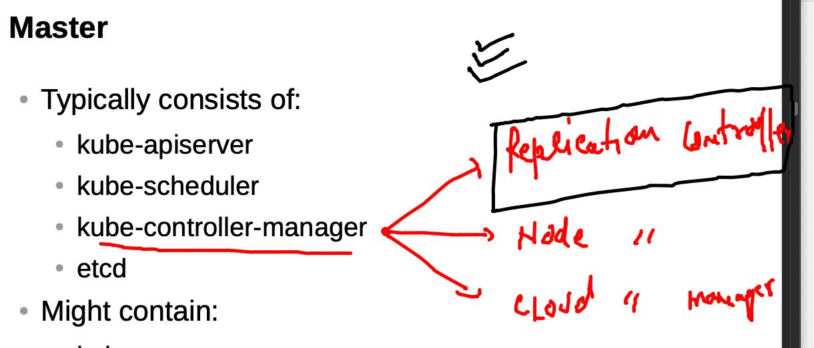
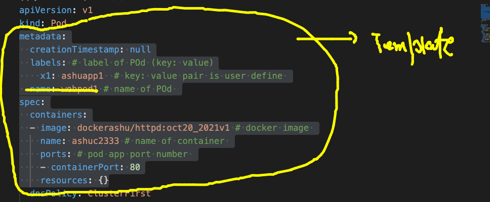
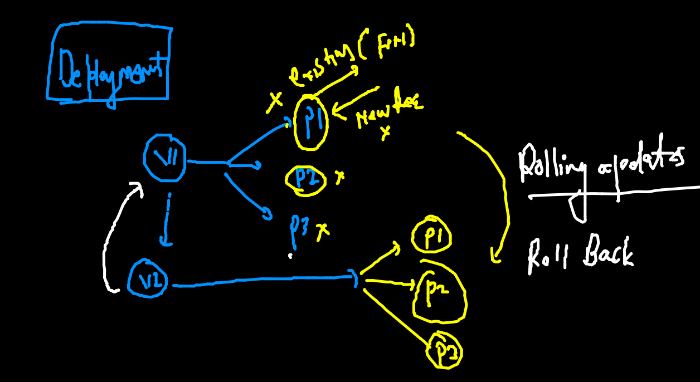
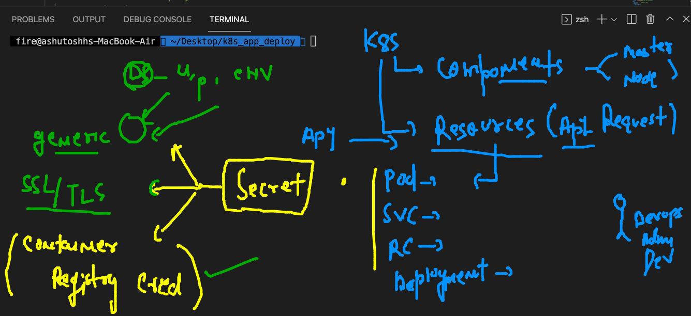
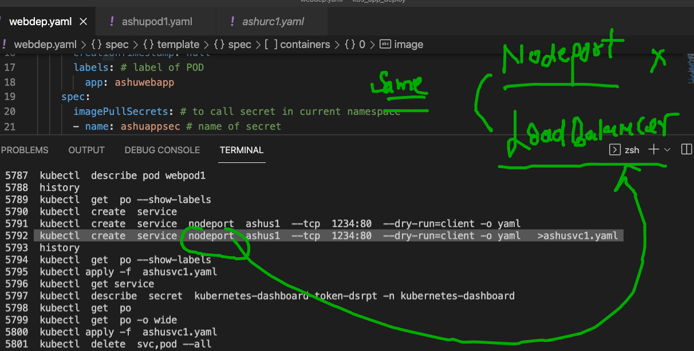
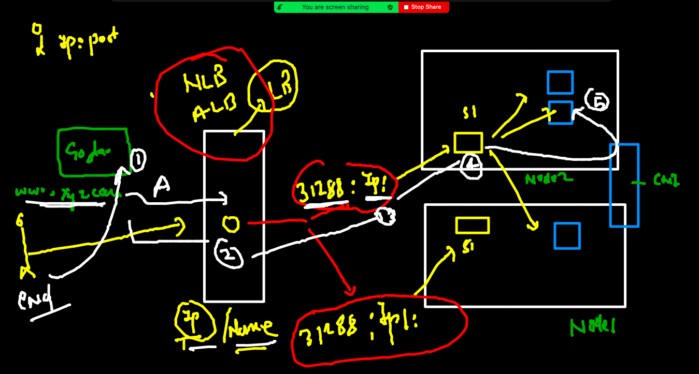
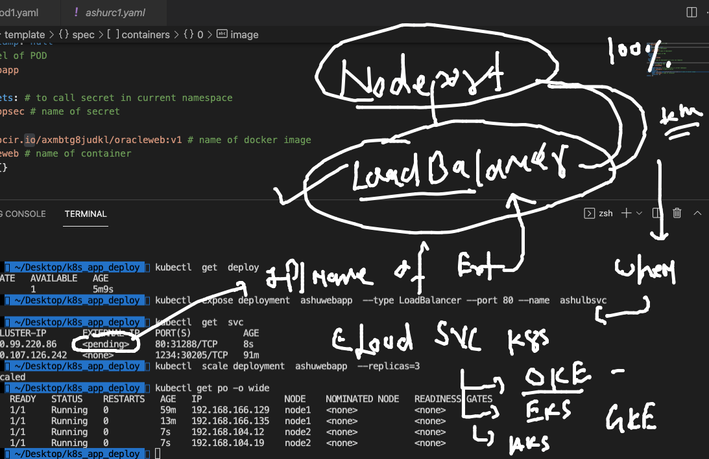

# Plan of training 


## checking k8s clsuter connection 

```
===
kubectl  get  nodes
NAME         STATUS   ROLES                  AGE   VERSION
masternode   Ready    control-plane,master   25h   v1.22.2
node1        Ready    <none>                 25h   v1.22.2
node2        Ready    <none>                 25h   v1.22.2

===
kubectl  config get-contexts    
CURRENT   NAME                          CLUSTER      AUTHINFO           NAMESPACE
*         kubernetes-admin@kubernetes   kubernetes   kubernetes-admin   ashu-space

===

kubectl delete pods --all
pod "ashupod1" deleted
pod "webpod1" deleted
 fire@ashutoshhs-MacBook-Air  ~  

```

### checking labels from command line 

```
kubectl  get  po --show-labels
NAME      READY   STATUS    RESTARTS   AGE     LABELS
webpod1   1/1     Running   0          4m38s   x1=ashuapp1

```

## Service NodePort 



## creating nodeport service 

```
kubectl  create  service 
Create a service using specified subcommand.

Aliases:
service, svc

Available Commands:
  clusterip    Create a ClusterIP service.
  externalname Create an ExternalName service.
  loadbalancer Create a LoadBalancer service.
  nodeport     Create a NodePort service.
  
```

### creating 

```
 kubectl  create  service  nodeport  ashus1  --tcp  1234:80  --dry-run=client -o yaml 
apiVersion: v1
kind: Service
metadata:
  creationTimestamp: null
  labels:
    app: ashus1
  name: ashus1
spec:
  ports:
  - name: 1234-80
    port: 1234
    protocol: TCP
    targetPort: 80
  selector:
    app: ashus1
  type: NodePort
status:
  loadBalancer: {}
 fire@ashutoshhs-MacBook-Air  ~/Desktop/k8s_app_deploy  kubectl  create  service  nodeport  ashus1  --tcp  1234:80  --dry-run=client -o yaml   >ashusvc1.yaml
 
 ```
 
 ### matching service selector to label of POD 
 
 
 
 ### Deployed service yaml 
 
 
 
 ```
 kubectl apply -f  ashusvc1.yaml 
service/ashus1 created
 fire@ashutoshhs-MacBook-Air  ~/Desktop/k8s_app_deploy  kubectl  get service 
NAME     TYPE       CLUSTER-IP       EXTERNAL-IP   PORT(S)          AGE
ashus1   NodePort   10.105.229.142   <none>        1234:32328/TCP   8s

```
### deploy pod ,svc using single yaml file 

```
kubectl  get  po,svc
NAME          READY   STATUS    RESTARTS   AGE
pod/webpod1   1/1     Running   0          17s

NAME             TYPE       CLUSTER-IP       EXTERNAL-IP   PORT(S)          AGE
service/ashus1   NodePort   10.109.227.189   <none>        1234:31291/TCP   16s

```

### cleaning up my namespace 

```
kubectl  delete  all --all 
pod "webpod1" deleted
service "ashus1" deleted

```

## Replication controller



### Template for POD 



### deploying rc 

```
fire@ashutoshhs-MacBook-Air  ~/Desktop/k8s_app_deploy  kubectl  apply -f  ashurc1.yaml 
replicationcontroller/ashurc-app created
service/ashus1 created
 fire@ashutoshhs-MacBook-Air  ~/Desktop/k8s_app_deploy  kubectl  get  rc
NAME         DESIRED   CURRENT   READY   AGE
ashurc-app   1         1         1       10s
 fire@ashutoshhs-MacBook-Air  ~/Desktop/k8s_app_deploy  kubectl  get  po 
NAME               READY   STATUS    RESTARTS   AGE
ashurc-app-vssdc   1/1     Running   0          19s
 fire@ashutoshhs-MacBook-Air  ~/Desktop/k8s_app_deploy  kubectl  get  svc
NAME     TYPE       CLUSTER-IP       EXTERNAL-IP   PORT(S)          AGE
ashus1   NodePort   10.107.126.242   <none>        1234:30205/TCP   23s

```

## scaling POD manually 

```
  0          34m   x1=ashuapp1
 fire@ashutoshhs-MacBook-Air  ~/Desktop/k8s_app_deploy  kubectl  scale rc  ashurc-app --replicas=3
replicationcontroller/ashurc-app scaled
 fire@ashutoshhs-MacBook-Air  ~/Desktop/k8s_app_deploy  kubectl  get  po --show-labels            
NAME               READY   STATUS    RESTARTS   AGE   LABELS
ashurc-app-77p4g   1/1     Running   0          61s   x1=ashuapp1
ashurc-app-p4g54   1/1     Running   0          5s    x1=ashuapp1
ashurc-app-vssdc   1/1     Running   0          35m   x1=ashuapp1

```

### Intro to deployment 



### creating deployment YAML 

```
kubectl  create deployment  ashuwebapp --image=phx.ocir.io/axmbtg8judkl/oracleweb:v1    --dry-run=client -o yaml 
apiVersion: apps/v1
kind: Deployment
metadata:
  creationTimestamp: null
  labels:
    app: ashuwebapp
  name: ashuwebapp
spec:
  replicas: 1
  selector:
    matchLabels:
      app: ashuwebapp
  strategy: {}
  template:
    metadata:
      creationTimestamp: null
      labels:
        app: ashuwebapp
    spec:
      containers:
      - image: phx.ocir.io/axmbtg8judkl/oracleweb:v1
        name: oracleweb
        resources: {}
status: {}

==

kubectl  create deployment  ashuwebapp --image=phx.ocir.io/axmbtg8judkl/oracleweb:v1    --dry-run=client -o yaml   >webdep.yaml

```

### sample deployment file 

```
apiVersion: apps/v1 # apiVersion 
kind: Deployment
metadata:
  creationTimestamp: null
  labels: # label of deployment 
    app: ashuwebapp
  name: ashuwebapp # name of Deployment 
spec:
  replicas: 1 # number of POD 
  selector:
    matchLabels:
      app: ashuwebapp
  strategy: {}
  template: # like RC deployment will also use template 
    metadata:
      creationTimestamp: null
      labels: # label of POD 
        app: ashuwebapp
    spec:
      containers:
      - image: phx.ocir.io/axmbtg8judkl/oracleweb:v1 # name of docker image 
        name: oracleweb # name of container 
        resources: {}
status: {}


```

###  error in pulling private registry image by k8s

```
fire@ashutoshhs-MacBook-Air  ~/Desktop/k8s_app_deploy  kubectl get deploy
NAME         READY   UP-TO-DATE   AVAILABLE   AGE
ashuwebapp   0/1     1            0           107s
 fire@ashutoshhs-MacBook-Air  ~/Desktop/k8s_app_deploy  
 fire@ashutoshhs-MacBook-Air  ~/Desktop/k8s_app_deploy  kubectl get  po   
NAME                         READY   STATUS         RESTARTS   AGE
ashurc-app-gl6s5             1/1     Running        0          30m
ashuwebapp-74d5f5bc5-p5nfc   0/1     ErrImagePull   0          116s

```

### Intro to secret in k8s



### creating secret 

```
kubectl  create  secret  
Create a secret using specified subcommand.

Available Commands:
  docker-registry Create a secret for use with a Docker registry
  generic         Create a secret from a local file, directory or literal value
  tls             Create a TLS secret

Usage:

```

====
```
kubectl  create  secret  docker-registry  ashuappsec   --docker-server  phx.ocir.io  --docker-username  axmbdkl/learhbyme@gmail.com   --docker-password="dh4iw{"
```

### creating Loadbalancer 



### creating service using expose method 

```

 fire@ashutoshhs-MacBook-Air  ~/Desktop/k8s_app_deploy  kubectl  get  deploy
NAME         READY   UP-TO-DATE   AVAILABLE   AGE
ashuwebapp   1/1     1            1           5m9s
 fire@ashutoshhs-MacBook-Air  ~/Desktop/k8s_app_deploy  kubectl  expose deployment  ashuwebapp  --type LoadBalancer --port 80 --name  ashulbsvc 
service/ashulbsvc exposed
 fire@ashutoshhs-MacBook-Air  ~/Desktop/k8s_app_deploy  kubectl  get  svc
NAME        TYPE           CLUSTER-IP       EXTERNAL-IP   PORT(S)          AGE
ashulbsvc   LoadBalancer   10.99.220.86     <pending>     80:31288/TCP     8s
ashus1      NodePort       10.107.126.242   <none>        1234:30205/TCP   91m

```

### External DNS and Loadbalancer with Kubernetes 



## Loadbalancer service reality



