# Plan of training 


## agenda day 2


## TIPs 

### remove all the contaienrs

```
 docker rm $(docker ps -aq) -f
5c6c0228043b
6c0e36f56ba9

```

### remove one or all the images

```
 77  docker  rmi  33f742df6215
   78  docker  rmi $(docker images -q) -f
   
```


## app containerization 

### Building images 

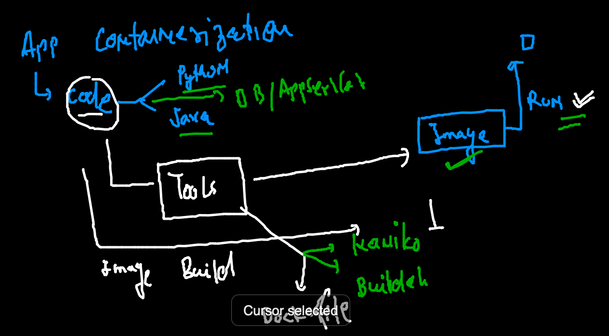

### Building python based code to image 

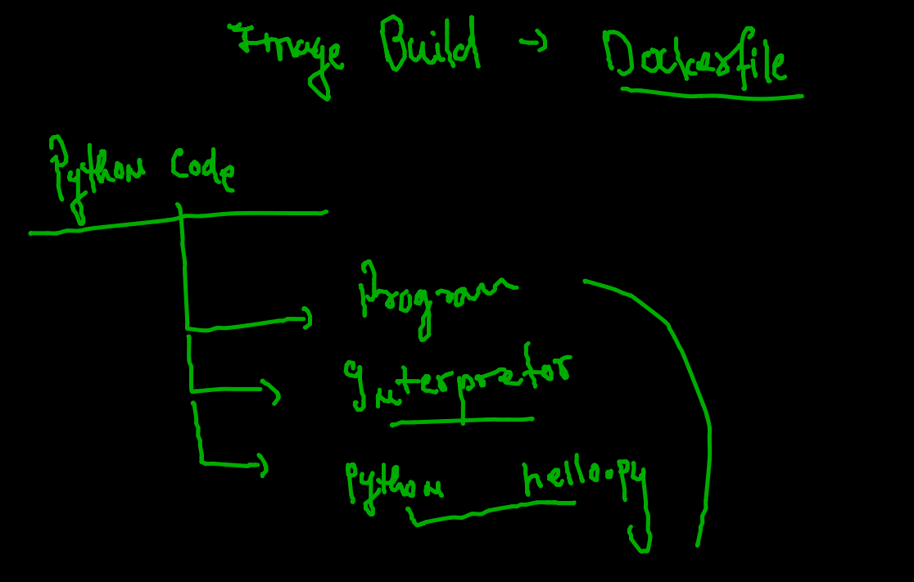

### Dockerfile for python code 

```
FROM python
# i am using python image from docker hub image 
# it will be automatically pulled by Docker engine if not present
LABEL name=ashutoshh
LABEL email=ashutoshh@linux.com
# optional field but good to share info 
RUN  mkdir  /mycode 
# RUN to get shell during image build time 
COPY  hello.py  /mycode/hello.py 
# copy code during image build time but make Dockerfile and code Location are
# same  / respective  
CMD  ["python","/mycode/hello.py"]
# CMD is to define default process for this Docker image
# here We are having python code run format as my default process

```

### Buiding image

```
[ashu@ip-172-31-19-234 python_apps]$ docker  build  -t  ashupython:v1  .  
Sending build context to Docker daemon  3.584kB
Step 1/6 : FROM python
latest: Pulling from library/python
bb7d5a84853b: Pull complete 
f02b617c6a8c: Pull complete 
d32e17419b7e: Pull complete 
c9d2d81226a4: Pull complete 
3c24ae8b6604: Pull complete 
8a4322d1621d: Pull complete 
2412fd0e5000: Pull complete 
0c700e8025db: Pull complete 
6e1cb03c0153: Pull complete 
Digest: sha256:d0075399d5663b0d8619d0260dddccee7b2ee8e6c66be441ba088607d3cc7e05
Status: Image is up to date for python:latest
 ---> c05c608cfa20
Step 2/6 : LABEL name=ashutoshh
 ---> Running in a97ccf6e3cf7
Removing intermediate container a97ccf6e3cf7
 ---> 5facd7b1e843
Step 3/6 : LABEL email=ashutoshh@linux.com
 ---> Running in 98d3a10bb39a
Removing intermediate container 98d3a10bb39a
 ---> f404f7b785f1
Step 4/6 : RUN  mkdir  /mycode
 ---> Running in 292b50c52075
Removing intermediate container 292b50c52075
 ---> 0dccb084f41c
Step 5/6 : COPY  hello.py  /mycode/hello.py
 ---> cbfed823dbfe
Step 6/6 : CMD  ["python","/mycode/hello.py"]
 ---> Running in a17a32fa0f89
Removing intermediate container a17a32fa0f89
 ---> 42f66a00af17
Successfully built 42f66a00af17
Successfully tagged ashupython:v1

```

### checking images

```
[ashu@ip-172-31-19-234 python_apps]$ docker  images
REPOSITORY         TAG       IMAGE ID       CREATED          SIZE
megha              v1        140d3ae1444c   22 seconds ago   915MB
nischalpython      v1        6f1ab2082b50   49 seconds ago   915MB
ashupython         v1        42f66a00af17   49 seconds ago   915MB

```

### creating and checking container 

```
[ashu@ip-172-31-19-234 python_apps]$ docker  run  -it  -d --name ashuc11  ashupython:v1  
351d28007c4b7f5149ef023857b91606b35e3d7c843a0db82c79192ed917b07f
[ashu@ip-172-31-19-234 python_apps]$ docker  ps
CONTAINER ID   IMAGE              COMMAND                  CREATED         STATUS         PORTS     NAMES
5215649c1a4e   manipython:v1      "python /mycode/hell…"   2 seconds ago   Up 1 second              manic2
319c45a141dd   dine:v1            "python /din/hello.py"   3 seconds ago   Up 2 seconds             din_container
2cde63ee598e   nischalpython:v1   "python /code/hello.…"   3 seconds ago   Up 2 seconds             nischalc1
351d28007c4b   ashupython:v1      "python /mycode/hell…"   5 seconds ago   Up 3 seconds             ashuc11

```

### checking output of code execution 

```
[ashu@ip-172-31-19-234 python_apps]$ docker logs -f  ashuc11
Hello all , welcome to python..!!
Welcome to Oracle Team..
Welcome to Containers ..!!
______________________
Hello all , welcome to python..!!
Welcome to Oracle Team..
Welcome to Containers ..!!

```

### checking resources of a container 

```
docker  stats  ashuc11


CONTAINER ID   NAME      CPU %     MEM USAGE / LIMIT    MEM %     NET I/O      BLOCK I/O     PIDS
351d28007c4b   ashuc11   0.01%     5.359MiB / 7.69GiB   0.07%     1.1kB / 0B   0B / 9.22kB   1
^C

===
C
[ashu@ip-172-31-19-234 python_apps]$ docker  stats  

781499279a3   vidhic1         0.01%     5.309MiB / 7.69GiB   0.07%     920B / 0B    0B / 12.8kB   1
112cc990c0ad   raju            0.00%     5.332MiB / 7.69GiB   0.07%     990B / 0B    0B / 18.4kB   1
912ff1508c77   umancont11      0.00%     5.418MiB / 7.69GiB   0.07%     990B / 0B    0B / 9.22kB   1
5215649c1a4e   manic2          0.00%     5.273MiB / 7.69GiB   0.07%     920B / 0B    0B / 19.5kB   1
319c45a141dd   din_container   0.00%     5.066MiB / 7.69GiB   0.06%     920B / 0B    0B / 11.8kB   1
2cde63ee598e   nischalc1       0.01%     3.047MiB / 7.69GiB   0.04%     710B / 0B    0B / 0B       1
351d28007c4b   ashuc11         0.00%     5.359MiB / 7.69GiB   0.07%     1.1kB / 0B   0B / 9.22kB   1

```


### access container 

```
[ashu@ip-172-31-19-234 python_apps]$ docker  exec -it   ashuc11   bash 
root@351d28007c4b:/# 
root@351d28007c4b:/# 
root@351d28007c4b:/# 
root@351d28007c4b:/# cat  /etc/os-release 
PRETTY_NAME="Debian GNU/Linux 11 (bullseye)"
NAME="Debian GNU/Linux"
VERSION_ID="11"
VERSION="11 (bullseye)"
VERSION_CODENAME=bullseye
ID=debian
HOME_URL="https://www.debian.org/"
SUPPORT_URL="https://www.debian.org/support"
BUG_REPORT_URL="https://bugs.debian.org/"
root@351d28007c4b:/# cd  /mycode/
root@351d28007c4b:/mycode# ls
hello.py
root@351d28007c4b:/mycode# 
root@351d28007c4b:/mycode# exit
exit

```

### Docker build image history 

```
83  docker  build  -t  ashupython:v1  .  
   84  history 
   85  docker  images
   86  ls
   87  docker  images
   88  docker  run  -it  -d --name ashuc11  ashupython:v1  
   89  docker  ps
   90  history 
   91  docker  ps
   92  docker  inspect  ashupython:v1 
   93  history 
   94  docker ps
   95  docker logs -f  ashuc11
   96  history 
   97  docker  ps
   98  history 
   99  docker  ps
  100  docker  info 
  101  docker  ps
  102  docker  stats  ashuc11
  103  docker  stats  
  104  history 
  105  docker  exec -it   ashuc11   bash 
  106  history 
  
  ```
  
  
### killing all running containers

```
[ashu@ip-172-31-19-234 python_apps]$ docker kill  $(docker ps  -q)
3c645a5cc4a4
30661233c34c
0a76cfcda5e4
f8caf0660cd5
7a3da97424d9
f28d5616e6e4

```

### removing all containers 

```
docker rm  $(docker ps  -aq)
```

### ANSwer to first Question 

```
[ashu@ip-172-31-19-234 ashuimages]$ docker  run -itd --name ashuc1 alpine ping localhost 
328b3e709419028baa88f480fb6c7985b9542d49bbc2ccace03e8f11aa34e5f6
[ashu@ip-172-31-19-234 ashuimages]$ docker  run -itd --name ashuc2 alpine ping localhost 
0c694b4bc342fcdcc84967fda9e96ba799e5c9b7e8ea83d74dcd9e2c81995e3a
[ashu@ip-172-31-19-234 ashuimages]$ docker  exec -it ashuc1 sh 
/ # ls
bin    etc    lib    mnt    proc   run    srv    tmp    var
dev    home   media  opt    root   sbin   sys    usr
/ # echo  hello  >helloc1.txt 
/ # ls
bin          helloc1.txt  media        proc         sbin         tmp
dev          home         mnt          root         srv          usr
etc          lib          opt          run          sys          var
/ # exit
[ashu@ip-172-31-19-234 ashuimages]$ docker  cp   ashuc1:/helloc1.txt  . 
[ashu@ip-172-31-19-234 ashuimages]$ ls
helloc1.txt  python_apps
[ashu@ip-172-31-19-234 ashuimages]$ docker  cp  helloc1.txt  ashuc2:/
[ashu@ip-172-31-19-234 ashuimages]$ docker  exec -it  ashuc2 sh 
/ # ls
bin          helloc1.txt  media        proc         sbin         tmp
dev          home         mnt          root         srv          usr
etc          lib          opt          run          sys          var
/ # exit

```

###  Dockerfile with OL  and python support 


###  building image helper software installer 

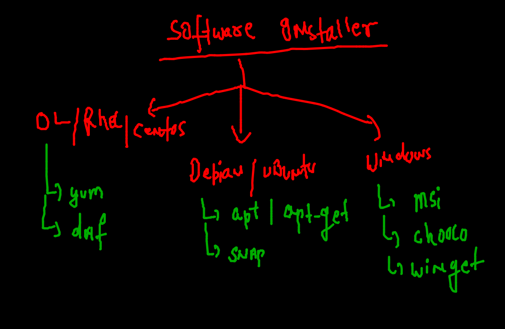

### BUilding image 

```
]$ cd  python_apps/
[ashu@ip-172-31-19-234 python_apps]$ ls
Dockerfile  hello.py  oracle.dockerfile
[ashu@ip-172-31-19-234 python_apps]$ docker  build -t  ashupython:v2  -f  oracle.dockerfile  . 
Sending build context to Docker daemon   5.12kB
Step 1/7 : FROM oraclelinux:8.4
 ---> 521767a68c46
Step 2/7 : LABEL name=ashutoshh
 ---> Running in fc5a7d7b4fe2
Removing intermediate container fc5a7d7b4fe2
 ---> 3693cc171455
Step 3/7 : LABEL email=ashutoshh@linux.com
 ---> Running in 1dae3f70f4ab
Removing intermediate container 1dae3f70f4ab
 ---> 43e3b7ea1abb
Step 4/7 : RUN yum  install python3 -y
 ---> Running in 7e09a75cd09a
Oracle Linux 8 BaseOS Latest (x86_64)           117 MB/s |  36 MB     00:00    
Oracle Linux 8 Application Stream (x86_64)       79 MB

```

### checking images

```
[ashu@ip-172-31-19-234 python_apps]$ docker  images  |   grep -i ashu
ashupython            v2        e2fb227b69e8   52 seconds ago       394MB
ashupython            v1        42f66a00af17   About an hour ago    915MB

```

### checking build history of image 

```
[ashu@ip-172-31-19-234 python_apps]$ docker  history  ashupython:v2
IMAGE          CREATED         CREATED BY                                      SIZE      COMMENT
e2fb227b69e8   3 minutes ago   /bin/sh -c #(nop)  CMD ["python3" "/mycode/h…   0B        
c14382854fd5   3 minutes ago   /bin/sh -c #(nop) ADD file:94726a4e08e7bb3ae…   239B      
1327f9ec4fbe   3 minutes ago   /bin/sh -c mkdir  /mycode                       0B        
e9fe39edd66f   3 minutes ago   /bin/sh -c yum  install python3 -y              148MB     
43e3b7ea1abb   4 minutes ago   /bin/sh -c #(nop)  LABEL email=ashutoshh@lin…   0B        
3693cc171455   4 minutes ago   /bin/sh -c #(nop)  LABEL name=ashutoshh         0B        
521767a68c46   5 days ago      /bin/sh -c #(nop)  CMD ["/bin/bash"]            0B        
<missing>      5 days ago      /bin/sh -c #(nop) ADD file:9bc973344d0614e05…   246MB     
[ashu@ip-172-31-19-234 python_apps]$ docker  images  |   grep -i oracle

```

### CMD vs entrypoint 

```
docker  run -itd --name ashuc9 --entrypoint ping  ashupython:v6   google.com 482b4db37db01cc6c8d431068059d4499e53e2c2fe4c5c7d7e09da3d5231cafd
[ashu@ip-172-31-19-234 python_apps]$ docker  ps
CONTAINER ID   IMAGE           COMMAND                  CREATED          STATUS          PORTS     NAMES
482b4db37db0   ashupython:v6   "ping google.com"        2 seconds ago    Up 1 second               ashuc9

```

## Cgroups 

```
 docker run -itd  --name ashuc2  --memory 100m --cpu-shares=30  alpine
 
```

### restart policy 

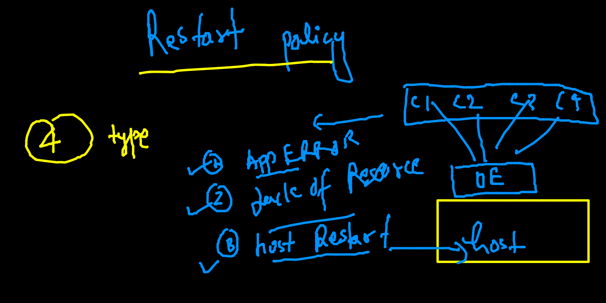

### restart policy options 

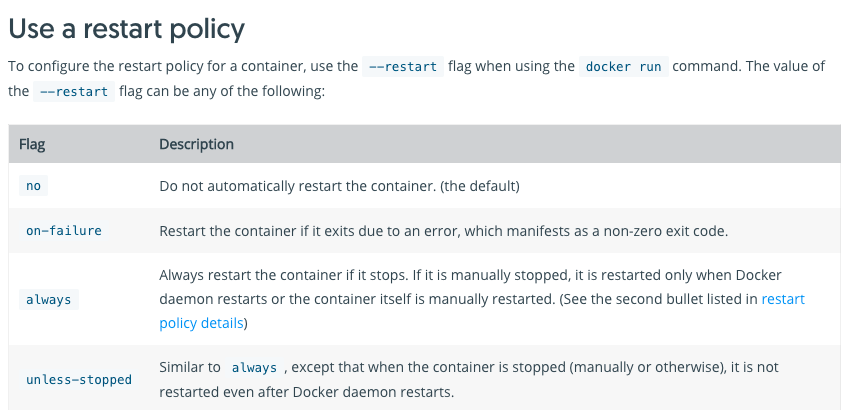

### formating json output 

```
[ashu@ip-172-31-19-234 ashuimages]$ docker  inspect  ashuc1  --format='{{.Id}}'
68c1d396752f86181a4e2661f56004166eded81d328f8923bfda6541093eba4b
[ashu@ip-172-31-19-234 ashuimages]$ docker  inspect  ashuc1  --format='{{.State.Status}}'
running

```

### chekcing and replacing restart policy 

```
[ashu@ip-172-31-19-234 ashuimages]$ docker  inspect  ashuc1  --format='{{.HostConfig.RestartPolicy.Name}}'
no
[ashu@ip-172-31-19-234 ashuimages]$ docker  update  ashuc1  --restart always 
ashuc1
[ashu@ip-172-31-19-234 ashuimages]$ docker  inspect  ashuc1  --format='{{.HostConfig.RestartPolicy.Name}}'
always
```

## Docker networking 

### COncept 1 

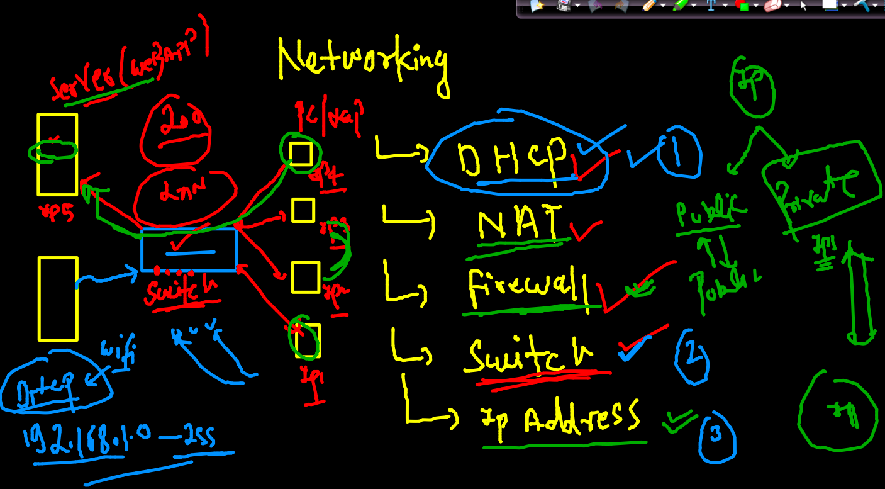

### NAT 

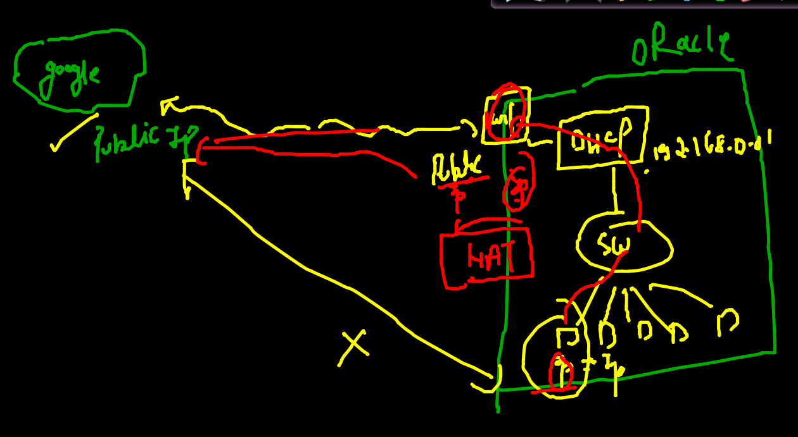

## Docker components with network

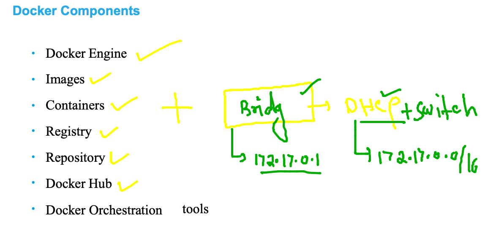

### Docker networking with BRidge (docker0)

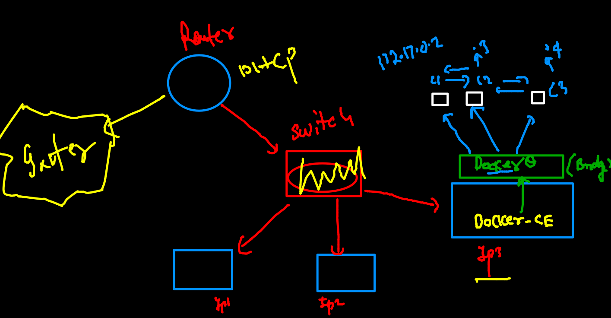

### checking ip address of container 

```
docker  inspect  ashuc1  --format='{{.NetworkSettings.IPAddress}}'
172.17.0.2
[ashu@ip-172-31-19-234 ashuimages]$ docker ps
CONTAINER ID   IMAGE           COMMAND            CREATED              STATUS              PORTS     NAMES
186e45d39a41   alpine:latest   "ping localhost"   13 seconds ago       Up 12 seconds                 parveezcg2
ec03b0c74667   alpine          "ping localhost"   18 seconds ago       Up 17 seconds                 manic1
012f92834cf2   alpine          "/bin/sh"          About a minute ago   Up About a minute             samarcont1
f4e131f0d524   busybox         "sh"               About a minute ago   Up About a minute             amitcg1
9f2a2529bd12   alpine          "/bin/sh"          2 minutes ago        Up 2 minutes                  vijaydg
c42ad5e696ab   alpine          "/bin/sh"          2 minutes ago        Up 2 minutes                  dinesh
6c2ade437f13   alpine          "/bin/sh"          2 minutes ago        Up 2 minutes                  nischalc1
a758ea8da764   alpine:latest   "/bin/sh"          2 minutes ago        Up 2 minutes                  wasimnw1
93c6b208b98d   busybox         "ping localhost"   2 minutes ago        Up 2 minutes                  raju1
795c9ea70635   alpine          "/bin/sh"          2 minutes ago        Up 2 minutes                  vidhicg2
47148c4af179   alpine          "/bin/sh"          2 minutes ago        Up 2 minutes                  umangc1
e49ca01a7e0e   alpine          "/bin/sh"          2 minutes ago        Up 2 minutes                  pavan1
bc62d0d91fd3   alpine          "/bin/sh"          2 minutes ago        Up 2 minutes                  ashuc1
[ashu@ip-172-31-19-234 ashuimages]$ docker  inspect  parveezcg2  --format='{{.NetworkSettings.IPAddress}}'
172.17.0.14

```

### checking connection 

```
[ashu@ip-172-31-19-234 ashuimages]$ docker  inspect  parveezcg2  --format='{{.NetworkSettings.IPAddress}}'
172.17.0.14
[ashu@ip-172-31-19-234 ashuimages]$ docker  exec -it  ashuc1  sh 
/ # 
/ # ping  172.17.0.14
PING 172.17.0.14 (172.17.0.14): 56 data bytes
64 bytes from 172.17.0.14: seq=0 ttl=255 time=0.158 ms
64 bytes from 172.17.0.14: seq=1 ttl=255 time=0.095 ms
64 bytes from 172.17.0.14: seq=2 ttl=255 time=0.072 ms
64 bytes from 172.17.0.14: seq=3 ttl=255 time=0.099 ms
64 bytes from 172.17.0.14: seq=4 ttl=255 time=0.090 ms
^C
--- 172.17.0.14 ping statistics ---
5 packets transmitted, 5 packets received, 0% packet loss
round-trip min/avg/max = 0.072/0.102/0.158 ms

```

### checking bridge details 

```
[ashu@ip-172-31-19-234 ashuimages]$ docker  network  ls 
NETWORK ID     NAME      DRIVER    SCOPE
a0aae296b56d   bridge    bridge    local
f5bbbab2e0d0   host      host      local
3c1fc83479d3   none      null      local
[ashu@ip-172-31-19-234 ashuimages]$ docker  network  inspect  a0aae296b56d 
[
    {
        "Name": "bridge",
        "Id": "a0aae296b56dbaf71b263ec7e586c8c4b52a50c8cd9d1f8a481896c8cbfb5c3c",
        "Created": "2021-10-19T03:36:22.250814513Z",
        "Scope": "local",
        "Driver": "bridge",
        "EnableIPv6": false,
        "IPAM": {
            "Driver": "default",
            "Options": null,
            "Config": [
                {
                    "Subnet": "172.17.0.0/16",
                    
 ```
 
 ### NAT in Docker Networking 
 
 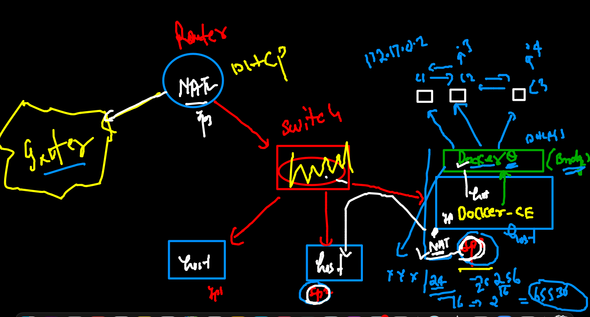
 
 ### POrt forwarding 
 
 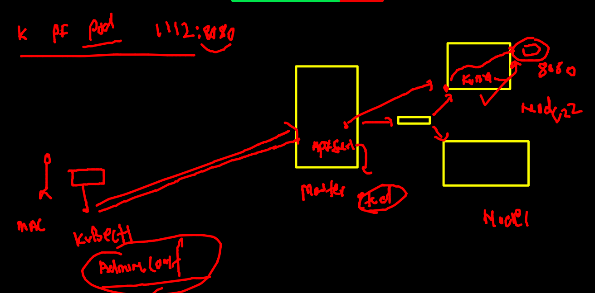
 
 

