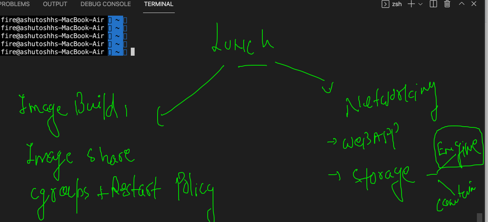

# Plan of training 


## agenda day 2



## TIPs 

### remove all the contaienrs

```
 docker rm $(docker ps -aq) -f
5c6c0228043b
6c0e36f56ba9

```

### remove one or all the images

```
 77  docker  rmi  33f742df6215
   78  docker  rmi $(docker images -q) -f
   
```


## app containerization 

### Building images 


### Building python based code to image 


### Dockerfile for python code 

```
FROM python
# i am using python image from docker hub image 
# it will be automatically pulled by Docker engine if not present
LABEL name=ashutoshh
LABEL email=ashutoshh@linux.com
# optional field but good to share info 
RUN  mkdir  /mycode 
# RUN to get shell during image build time 
COPY  hello.py  /mycode/hello.py 
# copy code during image build time but make Dockerfile and code Location are
# same  / respective  
CMD  ["python","/mycode/hello.py"]
# CMD is to define default process for this Docker image
# here We are having python code run format as my default process

```

### Buiding image

```
[ashu@ip-172-31-19-234 python_apps]$ docker  build  -t  ashupython:v1  .  
Sending build context to Docker daemon  3.584kB
Step 1/6 : FROM python
latest: Pulling from library/python
bb7d5a84853b: Pull complete 
f02b617c6a8c: Pull complete 
d32e17419b7e: Pull complete 
c9d2d81226a4: Pull complete 
3c24ae8b6604: Pull complete 
8a4322d1621d: Pull complete 
2412fd0e5000: Pull complete 
0c700e8025db: Pull complete 
6e1cb03c0153: Pull complete 
Digest: sha256:d0075399d5663b0d8619d0260dddccee7b2ee8e6c66be441ba088607d3cc7e05
Status: Image is up to date for python:latest
 ---> c05c608cfa20
Step 2/6 : LABEL name=ashutoshh
 ---> Running in a97ccf6e3cf7
Removing intermediate container a97ccf6e3cf7
 ---> 5facd7b1e843
Step 3/6 : LABEL email=ashutoshh@linux.com
 ---> Running in 98d3a10bb39a
Removing intermediate container 98d3a10bb39a
 ---> f404f7b785f1
Step 4/6 : RUN  mkdir  /mycode
 ---> Running in 292b50c52075
Removing intermediate container 292b50c52075
 ---> 0dccb084f41c
Step 5/6 : COPY  hello.py  /mycode/hello.py
 ---> cbfed823dbfe
Step 6/6 : CMD  ["python","/mycode/hello.py"]
 ---> Running in a17a32fa0f89
Removing intermediate container a17a32fa0f89
 ---> 42f66a00af17
Successfully built 42f66a00af17
Successfully tagged ashupython:v1

```

### checking images

```
[ashu@ip-172-31-19-234 python_apps]$ docker  images
REPOSITORY         TAG       IMAGE ID       CREATED          SIZE
megha              v1        140d3ae1444c   22 seconds ago   915MB
nischalpython      v1        6f1ab2082b50   49 seconds ago   915MB
ashupython         v1        42f66a00af17   49 seconds ago   915MB

```

### creating and checking container 

```
[ashu@ip-172-31-19-234 python_apps]$ docker  run  -it  -d --name ashuc11  ashupython:v1  
351d28007c4b7f5149ef023857b91606b35e3d7c843a0db82c79192ed917b07f
[ashu@ip-172-31-19-234 python_apps]$ docker  ps
CONTAINER ID   IMAGE              COMMAND                  CREATED         STATUS         PORTS     NAMES
5215649c1a4e   manipython:v1      "python /mycode/hell…"   2 seconds ago   Up 1 second              manic2
319c45a141dd   dine:v1            "python /din/hello.py"   3 seconds ago   Up 2 seconds             din_container
2cde63ee598e   nischalpython:v1   "python /code/hello.…"   3 seconds ago   Up 2 seconds             nischalc1
351d28007c4b   ashupython:v1      "python /mycode/hell…"   5 seconds ago   Up 3 seconds             ashuc11

```

### checking output of code execution 

```
[ashu@ip-172-31-19-234 python_apps]$ docker logs -f  ashuc11
Hello all , welcome to python..!!
Welcome to Oracle Team..
Welcome to Containers ..!!
______________________
Hello all , welcome to python..!!
Welcome to Oracle Team..
Welcome to Containers ..!!

```


