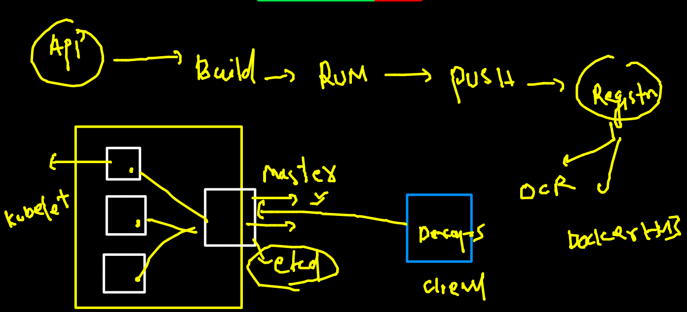

# Plan of training 


## Revision 



## K8s env setup options 


## Minikube 


### Installing Minikube On Mac 

[Install]('https://minikube.sigs.k8s.io/docs/start/')

```
curl -LO https://storage.googleapis.com/minikube/releases/latest/minikube-darwin-amd64
 sudo install minikube-darwin-amd64 /usr/local/bin/minikube
```


### checking installation 

```
minikube version 
minikube version: v1.23.2
commit: 0a0ad764652082477c00d51d2475284b5d39ceed
```

### MInikube to create Kubernetes ENV of single Node 

```
 fire@ashutoshhs-MacBook-Air  ~  minikube start 
😄  minikube v1.23.2 on Darwin 11.6
✨  Using the docker driver based on existing profile
👍  Starting control plane node minikube in cluster minikube
🚜  Pulling base image ...
🏃  Updating the running docker "minikube" container ...
🐳  Preparing Kubernetes v1.22.2 on Docker 20.10.8 ...
🔎  Verifying Kubernetes components...
    ▪ Using image gcr.io/k8s-minikube/storage-provisioner:v5
🌟  Enabled addons: storage-provisioner, default-storageclass
🏄  Done! kubectl is now configured to use "minikube" cluster and "default" namespace by default

```

### Status is running 

```
minikube  status
minikube
type: Control Plane
host: Running
kubelet: Running
apiserver: Running
kubeconfig: Configured


```

### checking k8s client software 

```
kubectl  version  --client 
Client Version: version.Info{Major:"1", Minor:"21", GitVersion:"v1.21.1", GitCommit:"5e58841cce77d4bc13713ad2b91fa0d961e69192", GitTreeState:"clean", BuildDate:"2021-05-12T14:18:45Z", GoVersion:"go1.16.4", Compiler:"gc", Platform:"darwin/amd64"}

```

### kubectl the client of kubernetes 

```
kubectl  version           
Client Version: version.Info{Major:"1", Minor:"21", GitVersion:"v1.21.1", GitCommit:"5e58841cce77d4bc13713ad2b91fa0d961e69192", GitTreeState:"clean", BuildDate:"2021-05-12T14:18:45Z", GoVersion:"go1.16.4", Compiler:"gc", Platform:"darwin/amd64"}
Server Version: version.Info{Major:"1", Minor:"22", GitVersion:"v1.22.2", GitCommit:"8b5a19147530eaac9476b0ab82980b4088bbc1b2", GitTreeState:"clean", BuildDate:"2021-09-15T21:32:41Z", GoVersion:"go1.16.8", Compiler:"gc", Platform:"linux/amd64"}
 fire@ashutoshhs-MacBook-Air  ~  
                                                                                                        
 fire@ashutoshhs-MacBook-Air  ~  
 fire@ashutoshhs-MacBook-Air  ~  kubectl  get   nodes
NAME       STATUS   ROLES                  AGE   VERSION
minikube   Ready    control-plane,master   14m   v1.22.2

```

### Any k8s cluster / master node you can connecting using token / certificates 

### On master node (cluster side) location of token file

```
 cd  /etc/kubernetes/
[root@masternode kubernetes]# ls
admin.conf  c

```

### connecting to k8s remote 

```
kubectl  get  nodes  --kubeconfig  admin.conf 
NAME         STATUS   ROLES                  AGE    VERSION
masternode   Ready    control-plane,master   128m   v1.22.2
node1        Ready    <none>                 127m   v1.22.2
node2        Ready    <none>                 127m   v1.22.2

```

### setting up admin.conf as default 

```
 cp -v  ~/Desktop/admin.conf  config 
/Users/fire/Desktop/admin.conf -> config
 fire@ashutoshhs-MacBook-Air  ~/.kube  ls
cache                  config.backup          kubectl_autocompletion
config                 http-cache             storage
 fire@ashutoshhs-MacBook-Air  ~/.kube  cd
                                                                                                             
 fire@ashutoshhs-MacBook-Air  ~  
 fire@ashutoshhs-MacBook-Air  ~  kubectl  get  nodes
NAME         STATUS   ROLES                  AGE    VERSION
masternode   Ready    control-plane,master   139m   v1.22.2
node1        Ready    <none>                 138m   v1.22.2
node2        Ready    <none>                 138m   v1.22.2

```

### Intro to POD 


### java webapp image building with Tomcat application 


###  Building docker image from github 

```
docker  build  -t  dockerashu/javawebapp:v1  https://github.com/redashu/javawebapp.git 
Sending build context to Docker daemon  154.6kB
Step 1/6 : FROM tomcat
latest: Pulling from library/tomcat
bb7d5a84853b: Pull complete 
f02b617c6a8c: Pull complete 
d32e17419b7e: Pull complete 
c9d2d81226a4: Pull complete 
fab4960f9cd2: Pull complete 
da1c1e7baf6d: Pull complete 
79b231561270: Pull complete 
7d337880d8b4: Pull complete 
2df65a31be06: Pull complete 
10cbf519de23: Pull complete 
Digest: sha256:7c30d3c92b191ec2b84f64be99326f9c83a4a4e079c899ee4d0a9a41abca8406
Status: Downloaded newer image for tomcat:latest
 ---> 4ce9babdd885
Step 2/6 : WORKDIR /usr/local/tomcat/webapps
 ---> Running in 1740c1a68d9b
Removing intermediate container 1740c1a68d9b

```

### testing container app 

```
 docker  run -itd --name ashujc1  -p 1166:8080  dockerashu/javawebapp:v1 
 
```

### push to dockerhub 

```
docker  login  
Login with your Docker ID to push and pull images from Docker Hub. If you don't have a Docker ID, head over to https://hub.docker.com to create one.
Username: dockerashu
Password: 
WARNING! Your password will be stored unencrypted in /home/ashu/.docker/config.json.
Configure a credential helper to remove this warning. See
https://docs.docker.com/engine/reference/commandline/login/#credentials-store

Login Succeeded
[ashu@ip-172-31-19-234 ashuimages]$ docker  push  dockerashu/javawebapp:v1
The push refers to repository [docker.io/dockerashu/javawebapp]
7b673bd563c8: Mounted from vidhijain27/javawebapp 
2d7b521c4bf7: Mounted from vidhijain27/javawebapp 
c27bab1cef5b: Mounted from vidhijain27/javawebapp 
7cee8d773191: Mounted from vidhijain27/javawebapp 
ecf2a68d58aa: Mounted from vidhijain27/javawebapp 
211736d7fc9d: Mounted from vidhijain27/javawebapp 
62a5b8741e83: Mounted from vidhijain27/javawebapp 
36e0782f1159: Mounted from vidhijain27/javawebapp 
ba6e5ff31f23: Mounted from vidhijain27/javawebapp 
9f9f651e9303: Mounted from vidhijain27/javawebapp 
0b3c02b5d746: Mounted from vidhijain27/javawebapp 
62a747bf1719: Mounted from vidhijain27/javawebapp 
v1: digest: sha256:06c4d0c690190703ab2d070c4b587ce0cfed9db58b2cfc3079fe9bd9f8f26805 size: 2838
[ashu@ip-172-31-19-234 ashuimages]$ docker logout 
Removing login credentials for https://index.docker.io/v1/

```

## First POD file 

```
apiVersion: v1 # kube-apiversion for POD request 
kind: Pod  # we are requesting for Pod 
metadata: # info about POd like name , annotation etc
 name: ashupod-javaweb 
spec: # about app info like - container , volume , secuirty , logging 
 containers: 
 - name: ashuc1 # name of container 
   image: dockerashu/javawebapp:v1 # image name from Dockerhub 
   ports: # to define container app port (optional)
   - containerPort: 8080 


```

### Deploying POD and checking 

```
 kubectl  apply -f  ashupod1.yaml 
pod/ashupod-javaweb created
 fire@ashutoshhs-MacBook-Air  ~/Desktop/k8s_app_deploy  kubectl  get  pods
NAME                 READY   STATUS             RESTARTS   AGE
ashupod-javaweb      1/1     Running            0          31s
manipod-javaweb      1/1     Running            0          20s

```

### checking pod scheduling node

```
 kubectl  get  nodes
NAME         STATUS   ROLES                  AGE     VERSION
masternode   Ready    control-plane,master   3h37m   v1.22.2
node1        Ready    <none>                 3h35m   v1.22.2
node2        Ready    <none>                 3h35m   v1.22.2
 fire@ashutoshhs-MacBook-Air  ~/Desktop/k8s_app_deploy  kubectl  get  po  ashupod-javaweb  -o wide
NAME              READY   STATUS    RESTARTS   AGE     IP              NODE    NOMINATED NODE   READINESS GATES
ashupod-javaweb   1/1     Running   0          8m54s   192.168.104.2   node2   <none>           <none>

```

###  all POd 

```
kubectl  get  po   -o wide
NAME                  READY   STATUS    RESTARTS   AGE     IP                NODE    NOMINATED NODE   READINESS GATES
aparspod-javaweb      1/1     Running   0          3m15s   192.168.104.12    node2   <none>           <none>
ashupod-javaweb       1/1     Running   0          10m     192.168.104.2     node2   <none>           <none>
dines-javaweb         1/1     Running   0          8m22s   192.168.166.132   node1   <none>           <none>
manipod-javaweb       1/1     Running   0          10m     192.168.104.3     node2   <none>           <none>
```

### getting more details about POD 

```
 kubectl  describe pod  ashupod-javaweb  
Name:         ashupod-javaweb
Namespace:    default
Priority:     0
Node:         node2/172.31.14.254
Start Time:   Thu, 21 Oct 2021 12:02:43 +0530
Labels:       <none>
Annotations:  cni.projectcalico.org/containerID: 3da066dc44a4769a8100ad8ec1370a04d3c16de360428a7aef1fe91400bbc959
              cni.projectcalico.org/podIP: 192.168.104.2/32
              cni.projectcalico.org/podIPs: 192.168.104.2/32
Status:       Running
IP:           192.168.104.2
IPs:
  IP:  192.168.104.2
Containers:
  ashuc1:
    Container ID:   docker://d58d3f3fe334920ea5bb71dfe8028bdf9363d33d1cb98b4daf8c77da485f1600
    Image:          dockerashu/javawebapp:v1
    Image ID:       docker-pullable://dockerashu/javawebapp@sha256:06c4d0c690190703ab2d070c4b587ce0cfed9db58b2cfc3079fe9bd9f8f26805
    Port:           8080/TCP
    Host Port:      0/TCP
    State:          Running
      Started:      Thu, 21 Oct 2021 12:03:00 +0530
    Ready:          True
    Restart Count:  0
```
### accessing app locally 

```
kubectl  port-forward  ashupod-javaweb    1122:8080
Forwarding from 127.0.0.1:1122 -> 8080
Forwarding from [::1]:1122 -> 8080
Handling connection for 1122
Handling connection for 1122
```

### Deleting pod 

```
kubectl  delete  pod  ashupod-javaweb
pod "ashupod-javaweb" deleted
```

##

```
kubectl  delete pods --all
pod "aparspod-javaweb" deleted
pod "dines-javaweb" deleted
pod "manipod-javaweb" deleted
pod "meghapod-javaweb" deleted
pod "parveezpod-javaweb" deleted
pod "vidhipod-javaweb" deleted
```

### kubectl port-forward explain 


### auto generate yaml / json 

```
kubectl  run  ashupod1  --image=alpine  --dry-run=client -o yaml
apiVersion: v1
kind: Pod
metadata:
  creationTimestamp: null
  labels:
    run: ashupod1
  name: ashupod1
spec:
  containers:
  - image: alpine
    name: ashupod1
    resources: {}
  dnsPolicy: ClusterFirst
  restartPolicy: Always
status: {}
```

##

```
kubectl  run  ashupod1  --image=alpine  --dry-run=client -o yaml >auto.yaml
```
## alpine image and parent process


### deploy pod yaml 

```
fire@ashutoshhs-MacBook-Air  ~/Desktop/k8s_app_deploy  kubectl apply -f  auto.yaml 
pod/ashupod1 created
 fire@ashutoshhs-MacBook-Air  ~/Desktop/k8s_app_deploy  kubectl  get  po
NAME          READY   STATUS    RESTARTS   AGE
ashupod1      1/1     Running   0          9s
nischalpod1   1/1     Running   0          6s
 fire@ashutoshhs-MacBook-Air  ~/Desktop/k8s_app_deploy  kubectl  get  po -o wide
NAME            READY   STATUS             RESTARTS     AGE   IP                NODE    NOMINATED NODE   READINESS GATES
ashupod1        1/1     Running            0            26s   192.168.104.14    node2   <none>           <none>
maniod2         0/1     CrashLoopBackOff   1 (7s ago)   9s    192.168.104.16    node2   <none>           <none>
meghapod1       1/1     Running            0            14s   192.168.166.139   node1   <none>           <none>
nischalpod1     1/1     Running        

```
### access container inside pod 

```
kubectl  exec -it  ashupod1  -- sh 
/ # 
/ # 
/ # 
/ # ls
bin    dev    etc    home   lib    media  mnt    opt    proc   root   run    sbin   srv    sys    tmp    usr    var
/ # cat  /etc/os-release 
NAME="Alpine Linux"
ID=alpine
VERSION_ID=3.14.2
PRETTY_NAME="Alpine Linux v3.14"
HOME_URL="https://alpinelinux.org/"
BUG_REPORT_URL="https://bugs.alpinelinux.org/"
/ # exit
```

### checking output 

```
kubectl  logs  -f  ashupod1

```
## Namespace COncept 


### Default namesapces in k8s

```
kubectl  get  namespaces
NAME                   STATUS   AGE
default                Active   6h20m
kube-node-lease        Active   6h20m
kube-public            Active   6h20m
kube-system            Active   6h20m
```
## kube-system namespace 


### 
```
kubectl  get  pods  -n  kube-system 
NAME                                       READY   STATUS    RESTARTS   AGE
calico-kube-controllers-75f8f6cc59-l9w6s   1/1     Running   0          6h22m
calico-node-4tkw4                          1/1     Running   0          6h22m
calico-node-qqfqg                          1/1     Running   0          6h22m
calico-node-vdgqf                          1/1     Running   0          6h22m
coredns-78fcd69978-t49b2                   1/1     Running   0          6h23m
coredns-78fcd69978-wc9xf                   1/1     Running   0          6h23m
etcd-masternode                            1/1     Running   0          6h23m
kube-apiserver-masternode                  1/1     Running   0          6h23m
kube-controller-manager-masternode         1/1     Running   0          6h23m
kube-proxy-7n897                           1/1     Running   0          6h23m
kube-proxy-chdhz                           1/1     Running   0          6h22m
kube-proxy-gvg5w                           1/1     Running   0          6h22m
kube-scheduler-masternode                  1/1     Running   0          6h23m
metrics-server-6fb5c69669-zfxl2            1/1     Running   0          6h20m
```

### creating namespace 
```
fire@ashutoshhs-MacBook-Air  ~/Desktop/k8s_app_deploy  kubectl  create  namespace  ashu-space 
namespace/ashu-space created
 fire@ashutoshhs-MacBook-Air  ~/Desktop/k8s_app_deploy  kubectl  get  ns
NAME                   STATUS   AGE
ashu-space             Active   11s
```
### Deploy pod in custom namespace and checking it
```
fire@ashutoshhs-MacBook-Air  ~/Desktop/k8s_app_deploy  kubectl apply -f  auto.yaml 
pod/ashupod1 created
 fire@ashutoshhs-MacBook-Air  ~/Desktop/k8s_app_deploy  kubectl get  po            
No resources found in default namespace.
 fire@ashutoshhs-MacBook-Air  ~/Desktop/k8s_app_deploy  kubectl get  po -n ashu-space 
NAME       READY   STATUS    RESTARTS   AGE
ashupod1   1/1     Running   0          18s
```

### Delete pod
```
kubectl  delete   po  ashupod1 -n ashu-space 
pod "ashupod1" deleted
```

### setting default namespace 

```
kubectl config set-context  --current --namespace=ashu-space 
Context "kubernetes-admin@kubernetes" modified.
 fire@ashutoshhs-MacBook-Air  ~/Desktop/k8s_app_deploy  
 fire@ashutoshhs-MacBook-Air  ~/Desktop/k8s_app_deploy  kubectl  config get-contexts                                 
CURRENT   NAME                          CLUSTER      AUTHINFO           NAMESPACE
*         kubernetes-admin@kubernetes   kubernetes   kubernetes-admin   ashu-space
```
## Creating webapp POD 

```
kubectl  run webpod1  --image=dockerashu/httpd:oct20_2021v1  --port 80  --dry-run=client -o yaml  >webapp.yaml
```

## K8s Networking 

### Nodes networking 


###  COntainer networking Models


### list of CNI 


### checking pod connection 

```
fire@ashutoshhs-MacBook-Air  ~/Desktop/k8s_app_deploy  kubectl  get po -o wide
NAME       READY   STATUS    RESTARTS   AGE   IP                NODE    NOMINATED NODE   READINESS GATES
ashupod1   1/1     Running   0          33m   192.168.104.55    node2   <none>           <none>
webpod1    1/1     Running   0          23m   192.168.166.178   node1   <none>           <none>
 fire@ashutoshhs-MacBook-Air  ~/Desktop/k8s_app_deploy  kubectl  exec -it  ashupod1  -- sh 
/ # 
/ # ping  192.168.166.178 
PING 192.168.166.178 (192.168.166.178): 56 data bytes
64 bytes from 192.168.166.178: seq=0 ttl=253 time=0.527 ms
64 bytes from 192.168.166.178: seq=1 ttl=253 time=1.183 ms
64 bytes from 192.168.166.178: seq=2 ttl=253 time=0.533 ms
^C
--- 192.168.166.178 ping statistics ---
3 packets transmitted, 3 packets received, 0% packet loss
round-trip min/avg/max = 0.527/0.747/1.183 ms
/ # exit

```
## CNI networking 


