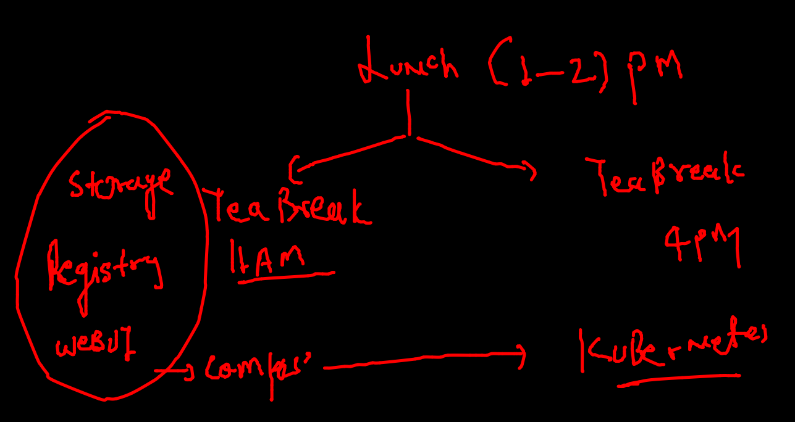

# Plan of training 


## day3 schedule



## REvision 


### CNA 


## Webapp COntainerization 

### pulling webapp code 

```

[ashu@ip-172-31-19-234 ashuimages]$ git  clone  https://github.com/mdn/beginner-html-site-styled
Cloning into 'beginner-html-site-styled'...
remote: Enumerating objects: 40, done.
remote: Total 40 (delta 0), reused 0 (delta 0), pack-reused 40
Receiving objects: 100% (40/40), 124.07 KiB | 15.51 MiB/s, done.
Resolving deltas: 100% (10/10), done.
[ashu@ip-172-31-19-234 ashuimages]$ ls
beginner-html-site-styled  helloc1.txt

```

### application server list


### Dockerfile and .dockerignore 

```
## Dockerfile :-

FROM oraclelinux:8.4 
LABEL email=ashutoshh@linux.com
RUN yum install httpd -y 
COPY . /var/www/html/
# COPY all the data from Dockerfile location to /var/www/html/
ENTRYPOINT httpd -DFOREGROUND
# to start httpd service we use 
#  systemctl start httpd ---> httpd -DFOREGROUND 

## .dockerignroe :-

LICENSE
*.md
Dockerfile
.dockerignore
.git
```

### building image 

```
[ashu@ip-172-31-19-234 ashuimages]$ ls
beginner-html-site-styled  helloc1.txt  python_apps
[ashu@ip-172-31-19-234 ashuimages]$ cd  beginner-html-site-styled/
[ashu@ip-172-31-19-234 beginner-html-site-styled]$ ls
CODE_OF_CONDUCT.md  Dockerfile  images  index.html  LICENSE  README.md  styles
[ashu@ip-172-31-19-234 beginner-html-site-styled]$ docker  build  -t  httpd:20oct2021v1   . 
Sending build context to Docker daemon  63.49kB
Step 1/5 : FROM oraclelinux:8.4
 ---> 521767a68c46
Step 2/5 : LABEL email=ashutoshh@linux.com
 ---> Running in 0f663b94cbf9
Removing intermediate container 0f663b94cbf9
 ---> 6ad9b2c17469
Step 3/5 : RUN yum install httpd -y
 ---> Running in 405a53b154c3
Oracle Linux 8 BaseOS Latest (x86_64)           120 MB/s |  36 MB     00:00    

```

### creating container 

```
docker  run -itd --name  ashuwebc1  -p  2233:80  httpd:20oct2021v1 
94b206d2157e691775d3fe1c2037b69a85a11c9b8598688447c52c4bea3516b0
[ashu@ip-172-31-19-234 beginner-html-site-styled]$ docker  ps
CONTAINER ID   IMAGE               COMMAND                  CREATED         STATUS         PORTS                                   NAMES
94b206d2157e   httpd:20oct2021v1   "/bin/sh -c 'httpd -…"   8 seconds ago   Up 6 seconds   0.0.0.0:2233->80/tcp, :::2233->80/tcp   ashuwebc1
[ashu@ip-172-31-19-234 beginner-html-site-styled]$ 

```

### Image sharing 


### docker image name reality 


### Docker hub understanding 


## pushing image

```

docker   tag  httpd:20oct2021v1         dockerashu/httpd:oct20_2021v1  
[ashu@ip-172-31-19-234 beginner-html-site-styled]$ 
[ashu@ip-172-31-19-234 beginner-html-site-styled]$ 
[ashu@ip-172-31-19-234 beginner-html-site-styled]$ docker  login  
Login with your Docker ID to push and pull images from Docker Hub. If you don't have a Docker ID, head over to https://hub.docker.com to create one.
Username: dockerashu
Password: 
WARNING! Your password will be stored unencrypted in /home/ashu/.docker/config.json.
Configure a credential helper to remove this warning. See
https://docs.docker.com/engine/reference/commandline/login/#credentials-store

Login Succeeded
[ashu@ip-172-31-19-234 beginner-html-site-styled]$ docker  push  dockerashu/httpd:oct20_2021v1
The push refers to repository [docker.io/dockerashu/httpd]
c5960db6acad: Pushed 
fb61fc01e160: Pushed 
67d008ba80bc: Mounted from library/oraclelinux 
oct20_2021v1: digest: sha256:9f70c1fd589d4bca9fe7a5d898e7ea47e3fbe6aa9e3e03e0507111f5ced0218a size: 951

```


### FROm diff docker engine i am pulling it 

```

 fire@ashutoshhs-MacBook-Air  ~  docker pull dockerashu/httpd:oct20_2021v1  
oct20_2021v1: Pulling from dockerashu/httpd
0b3f7bc5b3d7: Downloading     29MB/90.37MB
863c4bacdfb3: Downloading  29.55MB/104.3MB
536c16d52960: Download complete 

```

### Pushing image to OCR

```
[ashu@ip-172-31-19-234 beginner-html-site-styled]$ docker   tag  httpd:20oct2021v1     phx.ocir.io/axmbtg8judkl
[ashu@ip-172-31-19-234 beginner-html-site-styled]$ docker   tag  httpd:20oct2021v1     phx.ocir.io/axmbtg8judkl/webapp:v1  
[ashu@ip-172-31-19-234 beginner-html-site-styled]$ 
[ashu@ip-172-31-19-234 beginner-html-site-styled]$ 
[ashu@ip-172-31-19-234 beginner-html-site-styled]$ docker  login   phx.ocir.io  
Username: axmbtg8judkl/learntechbyme@gmail.com
Password: 
WARNING! Your password will be stored unencrypted in /home/ashu/.docker/config.json.
Configure a credential helper to remove this warning. See
https://docs.docker.com/engine/reference/commandline/login/#credentials-store

Login Succeeded
[ashu@ip-172-31-19-234 beginner-html-site-styled]$  docker  push  phx.ocir.io/axmbtg8judkl/webapp:v1
The push refers to repository [phx.ocir.io/axmbtg8judkl/webapp]
c5960db6acad: Pushed 
fb61fc01e160: Pushed 
67d008ba80bc: Pushed 
v1: digest: sha256:9f70c1fd589d4bca9fe7a5d898e7ea47e3fbe6aa9e3e03e0507111f5ced0218a size: 951
[ashu@ip-172-31-19-234 beginner-html-site-styled]$ 
[ashu@ip-172-31-19-234 beginner-html-site-styled]$ docker  logout  phx.ocir.io  
Removing login credentials for phx.ocir.io

```

## Storage for Docker engine 

### attching external storage 

```
[root@ip-172-31-19-234 docker]# lsblk 
NAME          MAJ:MIN RM  SIZE RO TYPE MOUNTPOINT
nvme0n1       259:0    0  100G  0 disk 
├─nvme0n1p1   259:1    0  100G  0 part /
└─nvme0n1p128 259:2    0    1M  0 part 
nvme1n1       259:3    0  500G  0 disk 
[root@ip-172-31-19-234 docker]# 
[root@ip-172-31-19-234 docker]# 
[root@ip-172-31-19-234 docker]# 
[root@ip-172-31-19-234 docker]# mkfs.xfs   /dev/nvme1n1 
meta-data=/dev/nvme1n1           isize=512    agcount=4, agsize=32768000 blks
         =                       sectsz=512   attr=2, projid32bit=1
         =                       crc=1        finobt=1, sparse=0
data     =                       bsize=4096   blocks=131072000, imaxpct=25
         =                       sunit=0      swidth=0 blks
naming   =version 2              bsize=4096   ascii-ci=0 ftype=1
log      =internal log           bsize=4096   blocks=64000, version=2
         =                       sectsz=512   sunit=0 blks, lazy-count=1
realtime =none                   extsz=4096   blocks=0, rtextents=0
[root@ip-172-31-19-234 docker]# mkdir  /mnt/oracle 
[root@ip-172-31-19-234 docker]# mount  /dev/nvme1n1  /mnt/oracle/

```

### COnfiure docker storgae 

```
# cd  /etc/sysconfig/
[root@ip-172-31-19-234 sysconfig]# ls
acpid       clock     docker          init        modules          nfs            rpcbind      run-parts  sysstat.ioconf
atd         console   docker-storage  irqbalance  netconsole       raid-check     rpc-rquotad  selinux
authconfig  cpupower  htcacheclean    keyboard    network          rdisc          rsyncd       sshd
chronyd     crond     i18n            man-db      network-scripts  readonly-root  rsyslog      sysstat
[root@ip-172-31-19-234 sysconfig]# cat  docker
# The max number of open files for the daemon itself, and all
# running containers.  The default value of 1048576 mirrors the value
# used by the systemd service unit.
DAEMON_MAXFILES=1048576

# Additional startup options for the Docker daemon, for example:
# OPTIONS="--ip-forward=true --iptables=true"
# By default we limit the number of open files per container
OPTIONS="--default-ulimit nofile=32768:65536 -g  /mnt/oracle"

# How many seconds the sysvinit script waits for the pidfile to appear
# when starting the daemon.
DAEMON_PIDFILE_TIMEOUT=10

```

### s

```

[root@ip-172-31-19-234 sysconfig]# systemctl daemon-reload 
[root@ip-172-31-19-234 sysconfig]# systemctl restart  docker
```

### sync / migrate docker data 

```
69  rsync -avp  /var/lib/docker/ /mnt/oracle/
   70  history 
[root@ip-172-31-19-234 oracle]# systemctl restart  docker

```

###  Docker volume. 

```
[ashu@ip-172-31-19-234 beginner-html-site-styled]$ docker  volume  ls
DRIVER    VOLUME NAME
local     ashshuvol1
[ashu@ip-172-31-19-234 beginner-html-site-styled]$ docker  volume  ls
DRIVER    VOLUME NAME
local     amitvolume1
local     aparsvol1
local     ashshuvol1
local     din
local     manivol1
local     nischalvol1
local     parveezvol1
local     pavanvol1
local     rajuvol1
local     umanv1
local     vidvol1
local     wasim_vol1
[ashu@ip-172-31-19-234 beginner-html-site-styled]$ docker  volume   inspect  ashshuvol1
[
    {
        "CreatedAt": "2021-10-20T07:12:32Z",
        "Driver": "local",
        "Labels": {},
        "Mountpoint": "/mnt/oracle/volumes/ashshuvol1/_data",
        "Name": "ashshuvol1",
        "Options": {},
        "Scope": "local"
    }
]

```

### checking storage option 

```
[ashu@ip-172-31-19-234 beginner-html-site-styled]$ docker  run -itd --name  ashuxc1  -v   ashshuvol1:/data:rw   alpine  
8218860bcfcb5d1338e0bcc9553551dc6dfeaa26f15b7e93d99cb85ed93b2924
[ashu@ip-172-31-19-234 beginner-html-site-styled]$ 
[ashu@ip-172-31-19-234 beginner-html-site-styled]$ 
[ashu@ip-172-31-19-234 beginner-html-site-styled]$ docker  exec -it  ashuxc1  sh 
/ # 
/ # cd  /data
/data # ls
/data # mkdir  hello world
/data # echo hello >a.txt
/data # ls
a.txt  hello  world
/data # exit
[ashu@ip-172-31-19-234 beginner-html-site-styled]$ docker  rm  ashuxc1 -f
ashuxc1
[ashu@ip-172-31-19-234 beginner-html-site-styled]$ 

```

### accessing the same volume data 

```
[ashu@ip-172-31-19-234 beginner-html-site-styled]$ docker  rm  ashuxc1 -f
ashuxc1
[ashu@ip-172-31-19-234 beginner-html-site-styled]$ 
[ashu@ip-172-31-19-234 beginner-html-site-styled]$ docker run -it --rm  -v   ashshuvol1:/new:ro   oraclelinux:8.4  bash 
[root@4d23aa5a3bd3 /]# 
[root@4d23aa5a3bd3 /]# 
[root@4d23aa5a3bd3 /]# cd  /new/
[root@4d23aa5a3bd3 new]# ls
a.txt  hello  world
[root@4d23aa5a3bd3 new]# exit
exit

```
### Docker volume mounts options 


## DOcker COmpose 


### Compose 


### Installing compose on Linux CLient 
## Docker Desktop already have compose installed

```
 2  sudo curl -L "https://github.com/docker/compose/releases/download/1.29.2/docker-compose-$(uname -s)-$(uname -m)" -o /usr/l
ocal/bin/docker-compose
    3  sudo chmod +x /usr/local/bin/docker-compose
    4  sudo ln -s /usr/local/bin/docker-compose /usr/bin/docker-compose
    
```

### checking version 

```

 docker-compose -v
docker-compose version 1.29.2, build 5becea4c

```


### REmove all data of docker engine 

```
351  docker  rm $(docker  ps -aq) -f
  352  docker rmi $(docker  images -q) -f
  353  docker  network  rm $(docker  network ls -q)
  354  docker  volumme  rm $(docker  volume ls -q)
  355  docker  volume  rm $(docker  volume ls -q)
  
```

### Deploy example 1 using compose file

### Example 1 

```
version: '3.8' # compose file version 
services: # to write about container apps 
 ashuapp1:  # name of my app 
  image: alpine
  container_name: ashucc1
  command: ping fb.com 
```

```
364  docker-compose up  -d  
  365  docker-compose  ps
  366  docker-compose  images
  367  docker-compose  logs
  368  history 
[ashu@ip-172-31-19-234 ashucompose]$ docker-compose  ps
 Name       Command     State   Ports
-------------------------------------
ashucc1   ping fb.com   Up           
[ashu@ip-172-31-19-234 ashucompose]$ docker-compose  stop
Stopping ashucc1 ... done
[ashu@ip-172-31-19-234 ashucompose]$ docker-compose  ps
 Name       Command      State     Ports
----------------------------------------
ashucc1   ping fb.com   Exit 137       

```

###  more operations 

```
[ashu@ip-172-31-19-234 ashucompose]$ docker-compose  kill
Killing ashucc1 ... done
[ashu@ip-172-31-19-234 ashucompose]$ docker-compose  rm
Going to remove ashucc1
Are you sure? [yN] y
Removing ashucc1 ... done
[ashu@ip-172-31-19-234 ashucompose]$ docker-compose  up -d
Creating ashucc1 ... done
[ashu@ip-172-31-19-234 ashucompose]$ docker-compose  ps
 Name       Command     State   Ports
-------------------------------------
ashucc1   ping fb.com   Up         

```

### remove all containers

```
[ashu@ip-172-31-19-234 ashucompose]$ docker-compose down 
Stopping ashucc1 ... done
Removing ashucc1 ... done
Removing network ashucompose_default

```


### example 2 

```
version: '3.8' # compose file version 
services: # to write about container apps 
 ashuwebapp: # name of first app 
  image: dockerashu/httpd:oct20_2021v1 
  container_name: ashuwebc1
  ports: # same as docker run -p 5566:80 
   - "5566:80"
 ashuapp1:  # name of second  app 
  image: alpine
  container_name: ashucc1
  command: ping fb.com 

```

### COmpsoe deploy 

```
[ashu@ip-172-31-19-234 ashucompose]$ docker-compose -f  compose1.yaml up  -d 
Creating network "ashucompose_default" with the default driver
Creating ashucc1   ... done
Creating ashuwebc1 ... done
[ashu@ip-172-31-19-234 ashucompose]$ docker-compose -f  compose1.yaml  ps
  Name                 Command              State                  Ports                
----------------------------------------------------------------------------------------
ashucc1     ping fb.com                     Up                                          
ashuwebc1   /bin/sh -c httpd -DFOREGROUND   Up      0.0.0.0:5588->80/tcp,:::5588->80/tcp

```

### DB yaml 

```
version: '3.8'
networks: # to create network  
 ashubrx1:  # name of bridge
volumes: # TO create volume 
 ashuvol1: # name of volume 
services:
 ashudb:
  image: mysql
  container_name: ashudbc1 
  restart: always # restart policy for container 
  environment: # ENv var for container 
   MYSQL_ROOT_PASSWORD: oracle088 
  volumes: # using above volume to store database & tables
  - "ashuvol1:/var/lib/mysql/"
  networks: # to use bridge 
  - ashubrx1 # name of bridge 
  
  
```
### login to DB container 

```
ashu@ip-172-31-19-234 ashucompose]$ docker-compose -f  db.yml  ps
  Name               Command             State          Ports       
--------------------------------------------------------------------
ashudbc1   docker-entrypoint.sh mysqld   Up      3306/tcp, 33060/tcp
[ashu@ip-172-31-19-234 ashucompose]$ 
[ashu@ip-172-31-19-234 ashucompose]$ 
[ashu@ip-172-31-19-234 ashucompose]$ docker  exec  -it  ashudbc1   bash 
root@9693b14c857b:/# 
root@9693b14c857b:/# mysql  -u root -p
Enter password: 
Welcome to the MySQL monitor.  Commands end with ; or \g.
Your MySQL connection id is 8
Server version: 8.0.27 MySQL Community Server - GPL

Copyright (c) 2000, 2021, Oracle and/or its affiliates.

Oracle is a registered trademark of Oracle Corporation and/or its
affiliates. Other names may be trademarks of their respective
owners.

Type 'help;' or '\h' for help. Type '\c' to clear the current input statement.

mysql> show databases;
+--------------------+
| Database           |
+--------------------+
| information_schema |
| mysql              |
| performance_schema |
| sys                |
+--------------------+
4 rows in set (0.01 sec)


```

### problem with Docker / ANy runtime Engine with respect to container management 


### COntainer orchestration 


