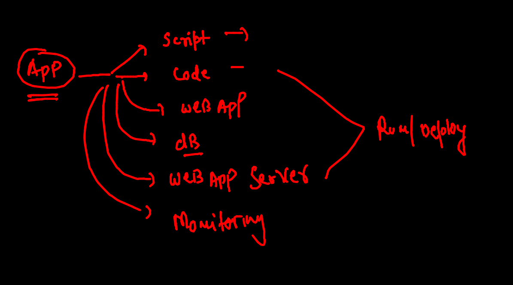
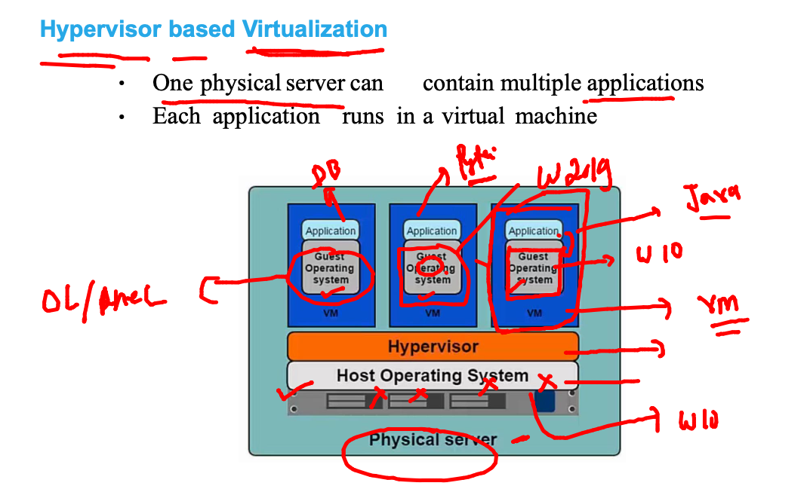
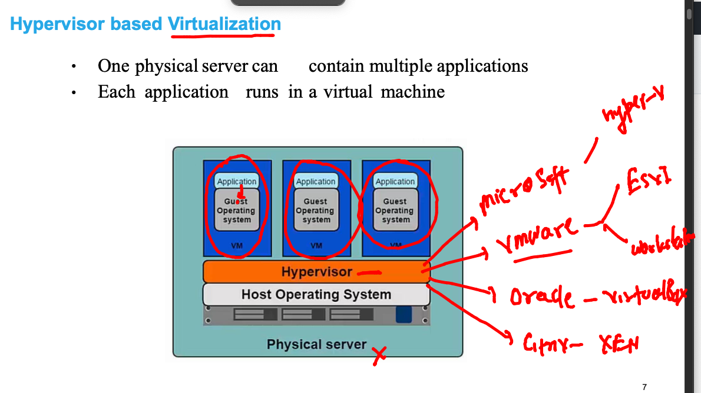

# Plan of training 


## app for this training 



## app deploy / testing problem in the past 

### when we were using baremetal / hardware based setup 


## Intro to hyper visor 



### Hyper visor options 



### benefit of using vm in cloud model (CNA)


### vm limitations


### OS means unwanted lib / apps --which is not required by app 


### OS Few libs are required by APP  (Not Entire OS required by any APP ) 


## Intro to containers


## CRE vs vm 


####


### vm vs cre final 


### list of CRE providers


## INtro to Docker 


### Docker ce Installation things


### Windows installing DOcker Desktop 


### checking docker client on mac / windows platform 

```
docker  -v
Docker version 20.10.8, build 3967b7d

```

### checking connection with docker engine from docker client 


### remote docker engine access


### To Install docker in amazon linux 

```
[root@ip-172-31-19-234 ~]# yum  install docker  -y
Failed to set locale, defaulting to C
Loaded plugins: extras_suggestions, langpacks, priorities, update-motd
amzn2-core                                                                                   | 3.7 kB  00:00:00     
Resolving Dependencies
--> Running transaction check
---> Package docker.x86_64 0:20.10.7-3.amzn2 will be installed
--> Processing Dependency: runc >= 1.0.0 for package: docker-20.10.7-3.amzn2.x86_64
--> Processing Dependency: libcgroup >= 0.40.rc1-5.15 for package: docker-20.10.7-3.amzn2.x86_64
--> Processing Dependency: containerd >= 1.3.2 for package: docker-20.10.7-3.amzn2.x86_64
--> Processing Dependency: pigz for package: docker-20.10.7-3.amzn2.x86_64
--> Running transaction check

```
### Document to install docker ce 

[link](https://docs.docker.com/engine/install/)

### starting docker engine 

```
[root@ip-172-31-19-234 ~]# systemctl enable --now docker
Created symlink from /etc/systemd/system/multi-user.target.wants/docker.service to /usr/lib/systemd/system/docker.service.
[root@ip-172-31-19-234 ~]# systemctl status  docker
● docker.service - Docker Application Container Engine
   Loaded: loaded (/usr/lib/systemd/system/docker.service; enabled; vendor preset: disabled)
   Active: active (running) since Mon 2021-10-18 09:05:40 UTC; 8s ago
     Docs: https://docs.docker.com
  Process: 31956 ExecStartPre=/usr/libexec/docker/docker-setup-runtimes.sh (code=exited, status=0/SUCCESS)
  Process: 31945 ExecStartPre=/bin/mkdir -p /run/docker (code=exited, status=0/SUCCESS)
 Main PID: 31962 (dockerd)
    Tasks: 7
   Memory: 38.6M
   CGroup: /system.slice/docker.service
           └─31962 /usr/bin/dockerd -H fd:// --containerd=/run/containerd/containerd.sock --default-ulimit nofile...


```

### checking login from

```
 fire@ashutoshhs-MacBook-Air  ~  ssh   ashu@34.195.216.111                             
ashu@34.195.216.111's password: 

       __|  __|_  )
       _|  (     /   Amazon Linux 2 AMI
      ___|\___|___|

https://aws.amazon.com/amazon-linux-2/
3 package(s) needed for security, out of 15 available
Run "sudo yum update" to apply all updates.
-bash: warning: setlocale: LC_CTYPE: cannot change locale (UTF-8): No such file or directory
[ashu@ip-172-31-19-234 ~]$ 
[ashu@ip-172-31-19-234 ~]$ 
[ashu@ip-172-31-19-234 ~]$ 
[ashu@ip-172-31-19-234 ~]$ 


```
### Docker. arch


### vm / container 

### REgistry 


## Docker basic operations 

### image search on docker hub 

```
[ashu@ip-172-31-19-234 ~]$ docker  search   mysql
NAME                              DESCRIPTION                                     STARS     OFFICIAL   AUTOMATED
mysql                             MySQL is a widely used, open-source relation…   11546     [OK]       
mariadb                           MariaDB Server is a high performing open sou…   4393      [OK]       
mysql/mysql-server                Optimized MySQL Server Docker images. Create…   854                  [OK]
percona                           Percona Server is a fork of the MySQL relati…   558       [OK]       
phpmyadmin                        phpMyAdmin - A web interface for MySQL and M…   346       [OK]       
centos/mysql-57-centos7           MySQL 5.7 SQL database server                   91                   
mysql/mysql-cluster               Experimental MySQL Cluster Docker images. Cr…   88                   
centurylink/mysql                 Image containing mysql. Optimized to be link…   59                   [OK]
databack/mysql-backup             Back up mysql databases to... anywhere!         51                   
prom/mysqld-exporter                                                              43                   [OK]

```

### checking images on docker host machine 

```
[ashu@ip-172-31-19-234 ~]$ docker  images
REPOSITORY   TAG       IMAGE ID   CREATED   SIZE
[ashu@ip-172-31-19-234 ~]$ 


```

### Docker image pulling 

```
[ashu@ip-172-31-19-234 ~]$ docker  pull   openjdk 
Using default tag: latest
latest: Pulling from library/openjdk
58c4eaffce77: Pull complete 
e6a22c806ee8: Pull complete 
4a88e5590ad1: Pull complete 
Digest: sha256:26ba405e50bea674fcab934c209e001c28e3da22a8678eabc73544655ff26734
Status: Downloaded newer image for openjdk:latest
docker.io/library/openjdk:latest

```

### docker images

```
[ashu@ip-172-31-19-234 ~]$ docker  images
REPOSITORY    TAG       IMAGE ID       CREATED       SIZE
openjdk       latest    744cf265878b   4 days ago    471MB
oraclelinux   8.4       521767a68c46   4 days ago    246MB
python        latest    c05c608cfa20   5 days ago    915MB
alpine        latest    14119a10abf4   7 weeks ago   5.6MB

```

### Creating container and understanding life of container 


