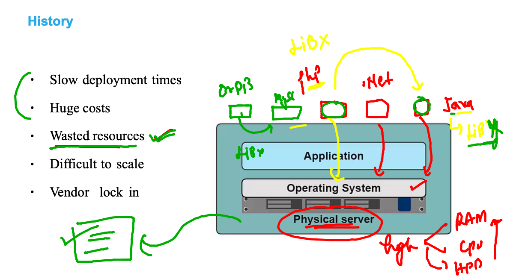

# Plan of training 

## app for this training 

## app deploy / testing problem in the past 

### when we were using baremetal / hardware based setup 

## Intro to hyper visor 

### Hyper visor options 

### benefit of using vm in cloud model (CNA)

### vm limitations

### OS means unwanted lib / apps --which is not required by app 

### OS Few libs are required by APP  (Not Entire OS required by any APP ) 

## Intro to containers

## CRE vs vm 

####

### vm vs cre final 

### list of CRE providers

## INtro to Docker 

### Docker ce Installation things

### Windows installing DOcker Desktop 

