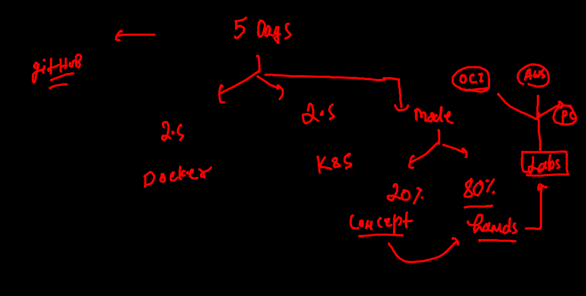

# Plan of training 



## day3 schedule


## REvision 


### CNA 


## Webapp COntainerization 

### pulling webapp code 

```

[ashu@ip-172-31-19-234 ashuimages]$ git  clone  https://github.com/mdn/beginner-html-site-styled
Cloning into 'beginner-html-site-styled'...
remote: Enumerating objects: 40, done.
remote: Total 40 (delta 0), reused 0 (delta 0), pack-reused 40
Receiving objects: 100% (40/40), 124.07 KiB | 15.51 MiB/s, done.
Resolving deltas: 100% (10/10), done.
[ashu@ip-172-31-19-234 ashuimages]$ ls
beginner-html-site-styled  helloc1.txt

```

### application server list


### Dockerfile and .dockerignore 

```
## Dockerfile :-

FROM oraclelinux:8.4 
LABEL email=ashutoshh@linux.com
RUN yum install httpd -y 
COPY . /var/www/html/
# COPY all the data from Dockerfile location to /var/www/html/
ENTRYPOINT httpd -DFOREGROUND
# to start httpd service we use 
#  systemctl start httpd ---> httpd -DFOREGROUND 

## .dockerignroe :-

LICENSE
*.md
Dockerfile
.dockerignore
.git
```

### building image 

```
[ashu@ip-172-31-19-234 ashuimages]$ ls
beginner-html-site-styled  helloc1.txt  python_apps
[ashu@ip-172-31-19-234 ashuimages]$ cd  beginner-html-site-styled/
[ashu@ip-172-31-19-234 beginner-html-site-styled]$ ls
CODE_OF_CONDUCT.md  Dockerfile  images  index.html  LICENSE  README.md  styles
[ashu@ip-172-31-19-234 beginner-html-site-styled]$ docker  build  -t  httpd:20oct2021v1   . 
Sending build context to Docker daemon  63.49kB
Step 1/5 : FROM oraclelinux:8.4
 ---> 521767a68c46
Step 2/5 : LABEL email=ashutoshh@linux.com
 ---> Running in 0f663b94cbf9
Removing intermediate container 0f663b94cbf9
 ---> 6ad9b2c17469
Step 3/5 : RUN yum install httpd -y
 ---> Running in 405a53b154c3
Oracle Linux 8 BaseOS Latest (x86_64)           120 MB/s |  36 MB     00:00    

```

### creating container 

```
docker  run -itd --name  ashuwebc1  -p  2233:80  httpd:20oct2021v1 
94b206d2157e691775d3fe1c2037b69a85a11c9b8598688447c52c4bea3516b0
[ashu@ip-172-31-19-234 beginner-html-site-styled]$ docker  ps
CONTAINER ID   IMAGE               COMMAND                  CREATED         STATUS         PORTS                                   NAMES
94b206d2157e   httpd:20oct2021v1   "/bin/sh -c 'httpd -…"   8 seconds ago   Up 6 seconds   0.0.0.0:2233->80/tcp, :::2233->80/tcp   ashuwebc1
[ashu@ip-172-31-19-234 beginner-html-site-styled]$ 

```

### Image sharing 


### docker image name reality 


### Docker hub understanding 


## pushing image

```

docker   tag  httpd:20oct2021v1         dockerashu/httpd:oct20_2021v1  
[ashu@ip-172-31-19-234 beginner-html-site-styled]$ 
[ashu@ip-172-31-19-234 beginner-html-site-styled]$ 
[ashu@ip-172-31-19-234 beginner-html-site-styled]$ docker  login  
Login with your Docker ID to push and pull images from Docker Hub. If you don't have a Docker ID, head over to https://hub.docker.com to create one.
Username: dockerashu
Password: 
WARNING! Your password will be stored unencrypted in /home/ashu/.docker/config.json.
Configure a credential helper to remove this warning. See
https://docs.docker.com/engine/reference/commandline/login/#credentials-store

Login Succeeded
[ashu@ip-172-31-19-234 beginner-html-site-styled]$ docker  push  dockerashu/httpd:oct20_2021v1
The push refers to repository [docker.io/dockerashu/httpd]
c5960db6acad: Pushed 
fb61fc01e160: Pushed 
67d008ba80bc: Mounted from library/oraclelinux 
oct20_2021v1: digest: sha256:9f70c1fd589d4bca9fe7a5d898e7ea47e3fbe6aa9e3e03e0507111f5ced0218a size: 951

```


### FROm diff docker engine i am pulling it 

```

 fire@ashutoshhs-MacBook-Air  ~  docker pull dockerashu/httpd:oct20_2021v1  
oct20_2021v1: Pulling from dockerashu/httpd
0b3f7bc5b3d7: Downloading     29MB/90.37MB
863c4bacdfb3: Downloading  29.55MB/104.3MB
536c16d52960: Download complete 

```

### Pushing image to OCR

```
[ashu@ip-172-31-19-234 beginner-html-site-styled]$ docker   tag  httpd:20oct2021v1     phx.ocir.io/axmbtg8judkl
[ashu@ip-172-31-19-234 beginner-html-site-styled]$ docker   tag  httpd:20oct2021v1     phx.ocir.io/axmbtg8judkl/webapp:v1  
[ashu@ip-172-31-19-234 beginner-html-site-styled]$ 
[ashu@ip-172-31-19-234 beginner-html-site-styled]$ 
[ashu@ip-172-31-19-234 beginner-html-site-styled]$ docker  login   phx.ocir.io  
Username: axmbtg8judkl/learntechbyme@gmail.com
Password: 
WARNING! Your password will be stored unencrypted in /home/ashu/.docker/config.json.
Configure a credential helper to remove this warning. See
https://docs.docker.com/engine/reference/commandline/login/#credentials-store

Login Succeeded
[ashu@ip-172-31-19-234 beginner-html-site-styled]$  docker  push  phx.ocir.io/axmbtg8judkl/webapp:v1
The push refers to repository [phx.ocir.io/axmbtg8judkl/webapp]
c5960db6acad: Pushed 
fb61fc01e160: Pushed 
67d008ba80bc: Pushed 
v1: digest: sha256:9f70c1fd589d4bca9fe7a5d898e7ea47e3fbe6aa9e3e03e0507111f5ced0218a size: 951
[ashu@ip-172-31-19-234 beginner-html-site-styled]$ 
[ashu@ip-172-31-19-234 beginner-html-site-styled]$ docker  logout  phx.ocir.io  
Removing login credentials for phx.ocir.io

```


